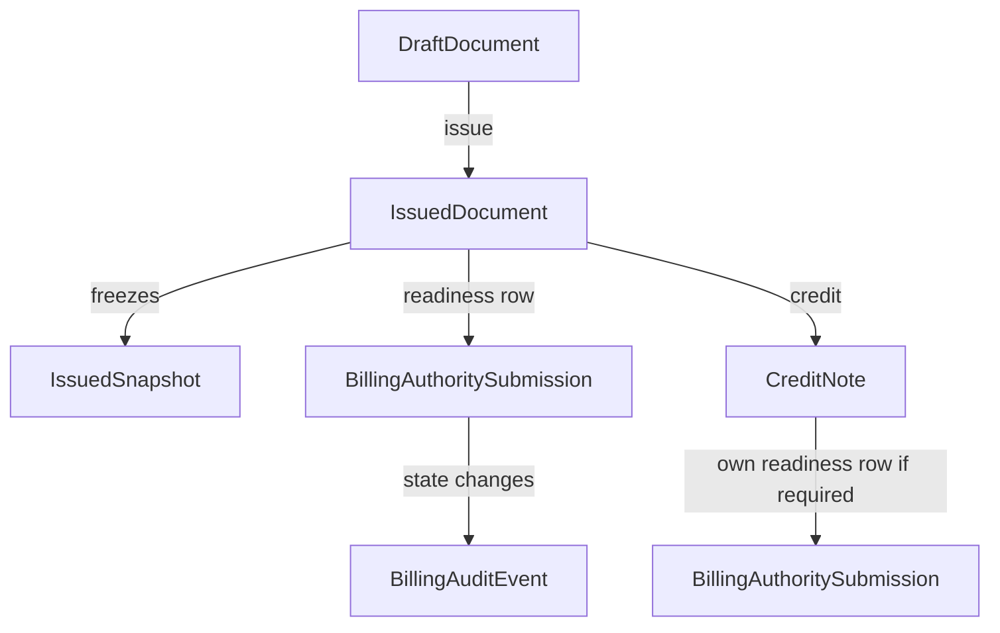
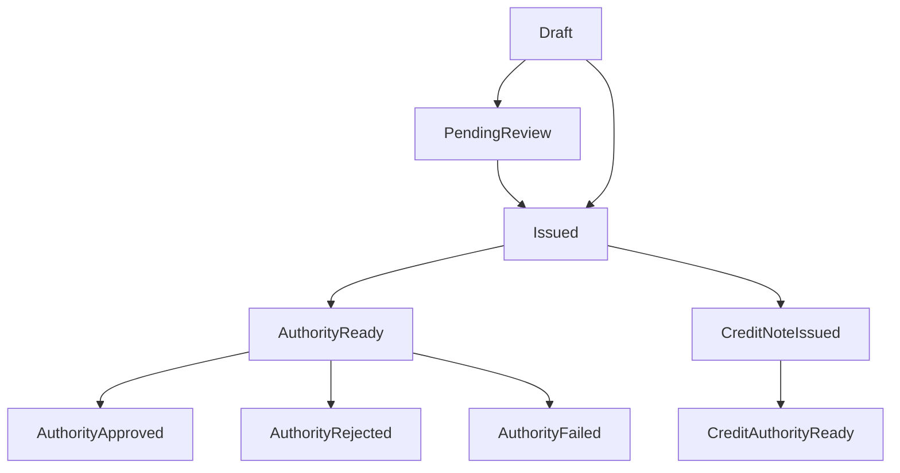

# Billing Authority / SHAAM Readiness Foundation Plan

This document defines the minimal future-ready authority foundation for
Billing/Invoices.

It is a planning artifact only. It does not implement schema changes,
migrations, runtime behavior, API calls, credentials, webhooks, polling,
background jobs, UI work, ERP behavior, or tax filing integration.

## Source Of Truth

This plan follows:

- `docs/billing-compliance-tax-authority-readiness-plan.md`
- `docs/billing-compliance-implementation-plan.md`
- `docs/billing-compliance-phase-1-immutable-issued-review.md`
- `docs/billing-credit-cancellation-architecture-plan.md`
- `docs/billing-credit-cancellation-implementation-review.md`
- `docs/billing-credit-reversal-phase-2a-scope-review.md`
- `docs/billing-dedicated-audit-foundation-plan.md`
- `docs/billing-dedicated-audit-implementation-scope-review.md`
- `docs/billing-dedicated-audit-phase-3a-implementation-review.md`

If this document conflicts with the compliance readiness plan, the compliance
readiness plan wins.

## Goal

Prepare Billing for future Tax Authority / SHAAM integration without
implementing integration now.

The system should be able to model:

- allocation numbers
- authority submission references
- authority status
- authority payload integrity
- authority failure/retry metadata
- auditability of authority state changes

without becoming:

- an ERP system
- a tax filing engine
- a background orchestration platform
- a webhook/polling framework
- a finance workflow engine

## Current Baseline

Billing currently has the required foundations to plan authority readiness:

- immutable issued documents
- `issuedSnapshot`
- `lockedAt`
- `legalSnapshotHash`
- numbering integrity
- credit-note reversal foundation
- dedicated `BillingAuditEvent`
- PDF hash/storage metadata

Current schema does not yet have a queryable authority model. The issued
snapshot shape already contains `allocationNumber: null`, but authority facts
must not live only inside PDFs or legal snapshots.

## Phase 4A Exact Scope

Phase 4A should be a foundation-only slice.

Include:

- a dedicated authority readiness model
- a minimal authority status lifecycle
- fields for allocation/submission references
- fields for payload/response integrity
- compact error and retry metadata
- guarded service rules for future implementation
- audit event definitions for future authority state changes
- archive/detail read-model direction

Do not include:

- SHAAM API client
- credentials
- real submission calls
- polling
- webhooks
- retry scheduler
- background workers
- raw request/response storage system
- UI implementation
- authority dashboard
- tax filing workflow

## Recommended Minimal Authority Model

Prefer a dedicated `BillingAuthoritySubmission` model over adding many
authority fields directly to `BillingDocument`.

Why:

- `BillingDocument` already represents the legal document and must stay stable.
- Authority state is operational/legal-adjacent metadata, not the invoice
  lifecycle itself.
- Future retries or attempts can be added without rewriting document rows.
- Archive/detail views can query document, PDF, audit, credit, and authority
  facts separately.

Recommended relationship:



## Minimal Schema Direction

Future implementation should add one model and one status enum/string.

Recommended model shape:

```prisma
model BillingAuthoritySubmission {
  id                    Int                    @id @default(autoincrement())
  businessId            Int
  billingDocumentId     Int
  status                BillingAuthorityStatus @default(READY)
  allocationNumber      String?
  authoritySubmissionId String?
  authorityPayloadHash  String?
  authorityResponseHash String?
  submittedAt           DateTime?
  approvedAt            DateTime?
  rejectedAt            DateTime?
  lastAttemptAt         DateTime?
  errorCode             String?
  errorMessage          String?
  retryCount            Int                    @default(0)
  createdAt             DateTime               @default(now())
  updatedAt             DateTime               @updatedAt

  business        Business        @relation(fields: [businessId], references: [id], onDelete: Restrict)
  billingDocument BillingDocument @relation(fields: [billingDocumentId], references: [id], onDelete: Restrict)

  @@index([businessId, status])
  @@index([businessId, lastAttemptAt])
  @@index([billingDocumentId])
}
```

Recommended status values:

```prisma
enum BillingAuthorityStatus {
  NOT_REQUIRED
  READY
  PENDING
  SUBMITTED
  APPROVED
  REJECTED
  FAILED
}
```

Phase 4A should not add a separate attempt-history model unless exact retry
requirements are known before implementation. If retry history becomes required,
add a future `BillingAuthoritySubmissionAttempt` model instead of overloading
the main readiness row.

## Required Vs Optional Fields

Required for a minimal serious foundation:

- `businessId`
- `billingDocumentId`
- `status`
- `allocationNumber`
- `authoritySubmissionId`
- `authorityPayloadHash`
- `authorityResponseHash`
- `submittedAt`
- `approvedAt`
- `rejectedAt`
- `lastAttemptAt`
- `errorCode`
- `errorMessage`
- `retryCount`
- `createdAt`
- `updatedAt`

Optional or future-only:

- raw `authorityResponse Json`
- raw request payload
- raw response payload
- attempt history table
- webhook event table
- credential references
- polling cursor fields
- scheduler metadata
- external integration tenant configuration

Not recommended:

- storing authority health booleans
- storing UI badge labels
- storing retry eligibility booleans
- adding authority fields only to `issuedSnapshot`
- mixing authority state into `BillingDocumentStatus`

## Recommended Authority Lifecycle

Recommended statuses:

- `NOT_REQUIRED`: this document does not require authority submission under the
  current product/legal rule.
- `READY`: issued document is eligible for future authority submission.
- `PENDING`: submission is being prepared or queued internally.
- `SUBMITTED`: a future external request was sent and a submission reference may
  exist.
- `APPROVED`: authority accepted the document and allocation/reference facts are
  final.
- `REJECTED`: authority returned a legal/business rejection.
- `FAILED`: operational or transient failure occurred without a final legal
  rejection.

Use `FAILED` for operational problems and `REJECTED` for authority/legal
rejections. Avoid a generic `ERROR` state because it hides the difference
between a retryable runtime problem and a legal rejection.

## Relationship To Invoice Lifecycle

Authority lifecycle must remain separate from billing document lifecycle.

Rules:

- `DRAFT` documents should not have final authority allocation numbers.
- `PENDING_REVIEW` documents should not have final authority allocation numbers.
- Authority submission readiness starts only after legal issuance.
- Authority payloads must be based on frozen `issuedSnapshot` and
  `legalSnapshotHash`.
- `TAX_INVOICE + ISSUED` is the primary authority-ready document.
- `CREDIT_NOTE + ISSUED` must be supported by the model because credit notes may
  need authority handling later.
- Authority approval must not unlock or mutate the source invoice.
- Rejections must not cause source invoice edits; corrections remain
  credit/reversal lifecycle work.



## Persisted Vs Derived

Persist:

- current `status`
- final `allocationNumber`
- final `authoritySubmissionId`
- submitted payload hash
- response hash/reference
- timestamps for submission, approval, rejection, and last attempt
- compact error code/message
- retry count

Derive:

- authority health
- needs-attention flag
- retry eligibility
- archive label
- UI badge wording
- stale/pending indicators

Do not persist:

- `isAuthorityHealthy`
- `needsAuthorityAttention`
- `canRetryNow`
- display labels
- computed warning flags

## Service Direction

Future implementation should add a dedicated authority service, for example:

```ts
createAuthorityReadinessForIssuedDocumentTx(tx, input)
recordAuthoritySubmissionAttemptTx(tx, input)
recordAuthorityApprovedTx(tx, input)
recordAuthorityRejectedTx(tx, input)
recordAuthorityFailedTx(tx, input)
getBillingAuthorityState(input)
```

Service rules:

- Only issued legal documents can receive authority readiness state.
- Source document must belong to the same business.
- `TAX_INVOICE` and `CREDIT_NOTE` should be supported.
- Accepted authority facts are immutable after approval.
- `APPROVED` records must not be overwritten by retries.
- Payload hash must match the frozen legal document payload used for
  submission.
- State changes must be auditable through `BillingAuditEvent`.
- No route should update authority fields directly.

## Immutable Authority Facts

After `APPROVED`, future implementation must treat these as immutable:

- `allocationNumber`
- `authoritySubmissionId`
- `authorityPayloadHash`
- `authorityResponseHash`
- `approvedAt`

Corrections must happen through legal lifecycle records, not mutation of an
approved authority record.

## Failure And Retry Philosophy

No retry scheduler is part of the foundation.

Rules:

- `FAILED` means operational failure; it may be retryable later.
- `REJECTED` means authority/legal rejection; it usually requires user review or
  legal correction flow.
- Retry must not mutate the issued document.
- Retry must not create duplicate final allocation numbers.
- Retry should reuse the same frozen payload hash unless the correction is a new
  legal document.
- If integration later needs full attempt history, add a dedicated attempt model.

## Audit Direction

Authority state changes must use dedicated Billing audit, not generic
`LearningEvent`.

Future transactional audit events:

- `BILLING_AUTHORITY_SUBMISSION_ATTEMPTED`
- `BILLING_AUTHORITY_APPROVED`
- `BILLING_AUTHORITY_REJECTED`
- `BILLING_AUTHORITY_FAILED`
- `BILLING_AUTHORITY_MARKED_NOT_REQUIRED`

Failure strategy:

- Authority state changes should be transactional with audit.
- If an authority state change writes to `BillingAuthoritySubmission` but audit
  fails, the state change should fail.
- Future operational API attempt logging may include best-effort telemetry, but
  legal authority state changes must not rely on telemetry.

Required audit metadata:

- `billingDocumentId`
- document type
- document number
- `legalSnapshotHash`
- authority status before and after, if available in service memory
- allocation number when approved
- authority submission id when known
- payload hash
- error code/message for failed or rejected states

## Archive And UI Direction

No UI implementation is part of this plan.

Future archive/detail behavior:

- Show allocation number as a quiet legal reference near document number.
- Show approved authority status calmly, not as a dashboard module.
- Show failed/rejected states as clear "needs attention" document state.
- Keep authority history inside the document legal timeline.
- Do not show retry actions before retry semantics exist.
- Do not imply real submission happened when only readiness state exists.

Recommended read model should expose:

- current authority status
- allocation number
- submission id
- last attempt timestamp
- approval/rejection timestamp
- compact error summary
- whether action is required, derived from status

## Dangerous Traps

Avoid:

- storing allocation numbers only in PDFs or snapshots
- mutating `issuedSnapshot` after authority approval
- mixing authority state into `BillingDocumentStatus`
- treating failed operational attempts as legal rejection
- treating legal rejection as a transient failure
- allowing duplicate active authority rows without a clear attempt model
- overwriting approved allocation numbers
- retrying with a different payload hash for the same issued document
- ignoring credit notes in the model
- building polling/webhooks/schedulers before state semantics are stable
- coupling UI copy to authority internals too early
- adding raw payload storage without retention/export policy

## Recommended Implementation Order

When implementation is approved, use this order:

1. Final Phase 4A scope review:
   - confirm exact model
   - confirm statuses
   - confirm whether one current row is enough for Phase 4A

2. Schema foundation:
   - add `BillingAuthoritySubmission`
   - add status enum or constrained string
   - add relations and indexes
   - keep migration additive and nullable where appropriate

3. Service foundation:
   - add guarded authority service
   - allow state only for issued documents
   - block approved fact mutation
   - avoid direct route updates

4. Audit wiring:
   - add authority event constants
   - write authority state changes transactionally with `BillingAuditEvent`

5. Read-model support:
   - expose current authority state for archive/detail APIs
   - derive labels and attention state

6. Future integration:
   - API client
   - credentials
   - retries
   - polling/webhooks
   - attempt history
   - raw response retention

## What Absolutely Must Exist Before Production

Billing should not be considered legal-production-ready until authority
readiness can store:

- queryable authority status outside PDFs/snapshots
- allocation number/reference when available
- submitted payload hash
- submission reference
- compact authority error/rejection state
- authority state audit events
- immutable accepted authority facts

## What Can Safely Wait

Safe to defer until real integration:

- SHAAM API client
- credentials and secret management
- polling
- webhooks
- retry scheduler
- background orchestration
- raw request/response tables
- attempt history
- authority dashboard
- accountant reports
- tax filing workflow

## Final Recommendation

Build Authority/SHAAM readiness as a small dedicated model plus guarded service
and audit semantics. Keep it separate from `BillingDocumentStatus`, never mutate
issued documents to reflect authority state, and defer all external integration
machinery until the local state model is stable.
