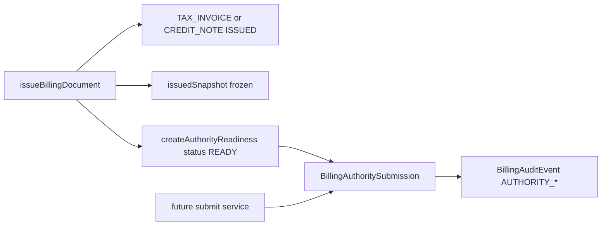

# Billing Compliance Hardening Plan — Binding Architecture Direction

**Status:** Frozen architecture direction (pre-H1).  
**Type:** Planning and architecture only — not an implementation brief.  
**Scope:** Billing, Invoice, Credit Note, Quote separation, FinancialEvent, Audit, Snapshot/PDF integrity, Identity, Authority readiness foundation.

This document is the **binding source of truth** for Billing compliance hardening and submit-ready preparation toward future Tax Authority / SHAAM system approval. It does **not** implement schema, migrations, services, routes, guards, authority API integration, allocation numbers, receipts, or ERP/bookkeeping behavior.

---

## Document Hierarchy

When Billing compliance work is planned or reviewed, use this order:

| Priority | Document | Role |
| -------- | -------- | ---- |
| 1 | `docs/billing-compliance-tax-authority-readiness-plan.md` | Overall compliance principles and priorities |
| 2 | **`docs/billing-compliance-hardening-plan.md` (this document)** | **Frozen hardening architecture, non-negotiables, phases H1–H6, anti-patterns** |
| 3 | `docs/billing-compliance-implementation-plan.md` | Historical implementation sequencing (Phases 1–5) |
| 4 | Domain plans | Immutable issued, credit/cancellation, dedicated audit, authority SHAAM foundation |

If this document conflicts with **product-specific legal regulation** (which is not defined here), mark gaps as **uncertainty** and do not invent requirements.

If this document conflicts with `billing-compliance-tax-authority-readiness-plan.md` on **principles**, the tax authority readiness plan wins. On **hardening structure and pre-submit phases (H1–H6)**, this document wins.

---

## How To Use This Document (Binding)

Every future Billing compliance change must:

- Be checked against this document before design or code review.
- Preserve the three-layer model: **Legal core** → **Integrity** → **Authority** (separate).
- Not mix Authority lifecycle into `BillingDocument` lifecycle or status.
- Not break `issuedSnapshot` as the legal content source for issued documents.
- Not add ERP, ledger, or bookkeeping semantics to Billing.
- Not generate issued invoice PDFs from live profile or draft rows.

**No H1 (or later) implementation should start** until the intended change is explicitly mapped to a phase (H1–H6) and does not violate **Architectural Non-Negotiables** or **What NOT To Build**.

---

## Compliance Architecture Summary

### Product positioning

The platform remains a **business SaaS with a Billing layer** — not an accounting system, not an ERP, not a tax filing engine. Compliance hardening strengthens **legal boundaries** and **auditability** without expanding into double-entry bookkeeping or bank reconciliation.

### Three pillars (target state)

```mermaid
flowchart TB
  subgraph legal [Legal Core]
    BD[BillingDocument ISSUED]
    SN[issuedSnapshot + legalSnapshotHash + lockedAt]
    BD --> SN
  end
  subgraph integrity [Integrity Layer]
    PDF[PDF bytes + pdfHash + template version]
    VER[Verify PDF matches snapshot hash policy]
    SN --> PDF
    PDF --> VER
  end
  subgraph authority [Authority Layer - separate]
    BAS[BillingAuthoritySubmission]
    SN --> BAS
    BAS --> AUD[BillingAuditEvent]
  end
  subgraph enforce [Enforcement]
    SVC[Service mutation gateway]
    DB[(DB-level guards - future)]
    legal --> enforce
  end
  legal --> integrity
  legal --> authority
```

| Layer | Responsibility |
| ----- | -------------- |
| **Legal core** | Document type, numbering, lifecycle to `ISSUED`, frozen snapshot, credit as separate document |
| **Integrity** | Deterministic PDF from snapshot; cache policy; hash verification; single canonical renderer in production |
| **Authority** | Queryable submission/allocation state **adjacent** to the document, not inside legal row mutation |
| **Enforcement** | Service-level gates today; DB-level immutability as hardening goal |

### Document types and “official” meaning

| Type | `ISSUED` allowed? | Legally official in product? |
| ---- | ----------------- | ---------------------------- |
| `TAX_INVOICE` | Yes | **Yes** — primary tax invoice |
| `CREDIT_NOTE` | Yes | **Yes** — reversal as separate document |
| `QUOTE` | **No** | **No** — commercial offer only; explicit PDF disclaimer |

**Not in scope:** `RECEIPT`, delivery notes, proforma as tax documents, etc.

### Lifecycle (billing document)

```
DRAFT → PENDING_REVIEW → ISSUED
         (invoices only; quotes skip PENDING_REVIEW)
```

- `ISSUED` is irreversible in product (no revert to `DRAFT`).
- Legal reversal: `CREDIT_NOTE` referencing issued `TAX_INVOICE`, not edit/delete of source.

---

## Current Baseline (As-Is, Code-Aligned)

This section describes what **exists today** — the foundation hardening must **preserve and strengthen**, not replace.

### Strengths already in production code

- Centralized issuance: `lib/services/billing/billing-issue.service.ts`
- `issuedSnapshot` + `legalSnapshotHash` + `lockedAt` on issue
- Per-business, per-`documentType` numbering via `BillingDocumentNumberSequence`
- Unique constraint: `(businessId, documentType, documentNumber)`
- Quote cannot be issued as tax invoice; conversion creates new `TAX_INVOICE` draft
- Issued invoice PDF reads **only** `issuedSnapshot` (`billing-pdf.service.ts`)
- `BillingAuditEvent` with `eventHash` (dedicated table)
- `FinancialEvent` only for `TAX_INVOICE` + `ISSUED` (idempotent)
- Credit note as separate `CREDIT_NOTE` with `referenceDocumentId`
- API routes delegate mutations to domain services (no direct Prisma document updates in billing routes)

### Known weaknesses (hardening targets)

- No `BillingAuthoritySubmission` model or lifecycle in runtime
- Immutability enforced primarily at **service** level; `assertIssuedMutationIsOperationalOnly` is **defined but unused**
- No DB triggers/policies blocking legal-field updates on `ISSUED`
- PDF cache for issued documents does not verify `pdfHash` against storage bytes or bind serve to `legalSnapshotHash`
- Dual PDF renderers (HTML default, pdfmake legacy) — divergence risk
- Customer `taxId` / `legalName` not captured in `issuedSnapshot` (always null today)
- `billingVatNumber` not required at issue gate
- `BillingAuditEvent` missing `before`/`after`, `previousEventHash`, IP/UA; PDF audit partly best-effort
- `Business` → `BillingDocument` cascade delete conflicts with long-term archive permanence goal
- `allocationNumber` in snapshot is always `null` (placeholder only)

---

## 1. Authority Foundation (Architecture Only)

**No integration, no allocation workflow, no API client** in hardening phases until explicitly planned after foundation.

### Missing entities (future)

| Entity | Purpose |
| ------ | ------- |
| `BillingAuthoritySubmission` | One readiness/submission row per issued document requiring authority handling |
| `BillingAuthorityStatus` | Lifecycle **separate** from `BillingDocumentStatus` |

Optional later: `BillingAuthoritySubmissionAttempt` if full retry history is required — do not overload the main row prematurely.

Detailed field and status recommendations: `docs/billing-authority-shaam-readiness-foundation-plan.md`.

### Recommended authority lifecycle

```
NOT_REQUIRED → READY → PENDING → SUBMITTED → APPROVED
                              ↘ REJECTED (legal/business)
                              ↘ FAILED (operational, retryable later)
```

| Status | Meaning |
| ------ | ------- |
| `NOT_REQUIRED` | Document type/rules exempt from submission |
| `READY` | Issued; eligible for future submission preparation |
| `PENDING` | Internal queue / preparation (no external API in foundation) |
| `SUBMITTED` | Future: external request sent; `authoritySubmissionId` may exist |
| `APPROVED` | Final allocation and references — **immutable** |
| `REJECTED` | Authority/legal rejection — not blind retry |
| `FAILED` | Transient/operational failure — retry without touching issued document |

Use `FAILED` vs `REJECTED` distinctly — do not collapse into a generic `ERROR`.

### Connection to `BillingDocument`



**Rules:**

- Authority readiness starts **only after** legal issuance.
- Payload for future submission must derive from `issuedSnapshot` + `legalSnapshotHash`, not live `BusinessProfile` or draft lines.
- `TAX_INVOICE` is primary; `CREDIT_NOTE` must be supported by the model for future rules.
- Approval/rejection/failure must **not** mutate source invoice legal fields or snapshot.
- Corrections remain credit/new document lifecycle — not authority row overwrite after `APPROVED`.

### Immutable after authority `APPROVED`

- `allocationNumber`
- `authoritySubmissionId`
- `authorityPayloadHash`
- `authorityResponseHash`
- `approvedAt`

### Retry philosophy (no scheduler in foundation)

- Retry does not edit `BillingDocument` legal content.
- Retry does not create duplicate final allocation numbers.
- Reuse frozen payload hash unless the correction is a **new legal document**.
- Legal audit for authority state changes must be **transactional** (failure to audit = failed state change).

---

## 2. Legal Immutability

### After `ISSUED` — must never change

| Category | Fields / data |
| -------- | ----------- |
| Document identity | `documentType`, `documentNumber`, `documentNumberFormatted` |
| Issue metadata | `issuedAt`, `issuedByUserId` |
| Legal content | `issuedSnapshot`, all `BillingDocumentLine` rows, `subtotalAmount`, `vatAmount`, `totalAmount`, `currency` |
| Customer on document | `customerId`, `customerNameSnapshot` (as stored at issue) |
| References | `referenceDocumentId` (credit linkage) |
| Lock markers | `lockedAt`, `legalSnapshotHash` |

### After `ISSUED` — may change (operational only)

| Category | Fields |
| -------- | ------ |
| PDF pipeline | `pdfRenderStatus`, `pdfStorageKey`, `pdfHash`, `pdfRenderedAt`, `pdfRenderError`, `pdfTemplateVersion` |
| Future | Payment tracking fields (when implemented per readiness plan) |
| Future | Authority row updates per authority lifecycle rules (separate model) |
| Audit | Append-only `BillingAuditEvent` inserts |

### Enforcement map (today)

| Layer | Status | Notes |
| ----- | ------ | ----- |
| **Service** | Partial | `assertCanMutateBillingLegalFields` in draft/transition services |
| **Service** | Gap | `assertIssuedMutationIsOperationalOnly` not wired |
| **Issue flow** | Strong | Conditional `updateMany`; quote blocked from issue |
| **Routes** | Good | Mutations via domain services |
| **DB** | **Missing** | No triggers/CHECK; cascade delete on business |
| **PDF** | Partial | Updates only PDF fields; no global operational-only enforcer |

### Hardening direction (H1 — planned, not in this doc’s implementation)

1. Single mutation gateway for `BillingDocument` / `BillingDocumentLine`.
2. Mandatory operational-only assertion on every issued update path.
3. Document decision: lock content in `PENDING_REVIEW` or keep as editable pre-issue (product call).
4. Future DB policies/triggers for `status = ISSUED`.
5. Retention: restrict cascade delete for issued documents and audit (future).

### Dangerous mutations / bypasses

| Risk | Severity |
| ---- | -------- |
| Direct Prisma/DB/scripts updating issued rows | Critical |
| New service bypassing guards | Critical |
| Deleting issued documents or lines | Critical (must remain impossible) |
| Reverting `ISSUED` status | Critical (must remain impossible) |
| Editing source invoice instead of credit note | Critical |

---

## 3. Snapshot / PDF Integrity

### Relationships

| Artifact | Role |
| -------- | ---- |
| `issuedSnapshot` | Legal truth for content at issue time |
| `legalSnapshotHash` | Integrity fingerprint of snapshot JSON (stable stringify + SHA-256) |
| PDF bytes | Derived representation for human/archive use |
| `pdfHash` | SHA-256 of PDF file bytes |
| `pdfTemplateVersion` | Includes template id + renderer id (e.g. `billing-v1-html`) |
| Storage key | `billing/{businessId}/{documentId}/{pdfHash}.pdf` |

**Invariant:** For `TAX_INVOICE` and `CREDIT_NOTE` in `ISSUED` status, PDF content must be produced from `issuedSnapshot`, never from live profile, customer record, or mutable draft lines.

### Quote (intentional difference)

- Quote PDF uses a **render-time** snapshot (`buildQuotePdfSnapshot`), not persisted `issuedSnapshot` on the row.
- Quote PDF includes explicit non-tax language in template footer.
- Quote cache may invalidate on document `updatedAt` — quotes are **not** legal documents.

### Verification target (H2)

On serve or export:

1. `SHA256(storedFile) === pdfHash`
2. `pdfTemplateVersion` matches current production canonical renderer version
3. Optional but recommended: `legalSnapshotHash` unchanged since render recorded in audit metadata
4. On mismatch: re-render from `issuedSnapshot`, audit the event

### Current gaps

- Cache hit does not re-verify file hash against DB
- Template version mismatch does not force re-render for issued invoices (MVP behavior documented in code)
- Two renderers can produce different output from same snapshot
- No `pdfContentBindingHash` linking snapshot + template + renderer (future additive field or audit metadata)

---

## 4. Identity & Required Legal Data

**No invented regulation** — only product-integrity and submit-readiness gaps.

### Issuer (`BusinessProfile`)

| Field | Required for issue today | In `issuedSnapshot` | Risk if missing/wrong |
| ----- | ------------------------ | ------------------- | --------------------- |
| `billingLegalName` | Yes | Yes | High |
| `billingBusinessKind` | Yes | extensions | Medium |
| `billingTaxId` | Yes | `issuer.taxId` | High |
| `billingVatNumber` | **No** | `issuer.vatRegistration` | Medium–High for authorized dealers |
| Address, phone, email | Yes | Yes | Medium |
| Payment/footer/logo | No | Optional in snapshot | Low |

Profile may change after issue; issued PDF must not (and today does not) read live profile.

### Customer

| Field | Today | H3 target |
| ----- | ----- | --------- |
| `customerNameSnapshot` | Required for issue | Keep |
| Customer tax id / legal name | Not collected | Add to snapshot when provided (schema v2 additive) |
| Customer address | Partial (city only via relation) | Evaluate for B2B |

### VAT / totals

- Line-level VAT in totals service — not a separate VAT engine (by design).
- `tax.vatMode` fixed to `EXCLUSIVE` in snapshot today.
- Business kind vs VAT display rules: **uncertainty** until business rules are defined with counsel.

---

## 5. Audit Hardening

### Today: `BillingAuditEvent`

- Append-only inserts with `eventHash`
- Transactional on issue; **best-effort** on some PDF paths
- Parallel `logAuditEvent` → telemetry (non-blocking) — must not be sole legal trail

### Gaps (H5)

| Capability | Status |
| ---------- | ------ |
| `before` / `after` on material changes | Missing |
| `previousEventHash` chain | Missing |
| `ipAddress`, `userAgent`, `requestId` | Missing |
| Authority events | Not defined until H4 |
| PDF render: required `legalSnapshotHash`, `pdfHash`, renderer | Partial |
| Critical path: audit failure fails operation | Partial (issue yes; PDF not always) |

### Target

- Legal/compliance events: **transactional**, document-linked, exportable timeline per `billingDocumentId`
- Telemetry remains separate — never substitute for `BillingAuditEvent` on issued/legal/authority actions

---

## 6. Renderer & PDF Strategy

| Decision | Direction |
| -------- | --------- |
| Production canonical renderer | **HTML** (Chromium) for Hebrew/RTL |
| pdfmake | Deprecate; non-production or explicit dev override only |
| Versioning | `{BILLING_PDF_TEMPLATE_VERSION}-{renderer}` — already in code direction |
| Per-document renderer switching | **Forbidden** in production |
| Issued PDF source | `issuedSnapshot` only |
| Quote PDF | Same renderer stack; different cache and disclaimer policy |

---

## Compliance Risk Matrix

| Area | Risk | Severity | Why |
| ---- | ---- | -------- | --- |
| Authority layer missing | No queryable submission/allocation model | **Critical** | Cannot demonstrate readiness for future SHAAM workflow |
| DB immutability missing | Legal fields updatable via bypass | **Critical** | Weak legal boundary |
| PDF/cache integrity | Serve without hash/snapshot verification | **High** | Official PDF may not match frozen legal record |
| Dual renderer | pdfmake + HTML in parallel | **High** | Non-deterministic output |
| Customer identity on snapshot | taxId/legalName always null | **High** | Incomplete legal party on document |
| Issuer VAT optional at gate | Authorized dealer without VAT on document | **Medium–High** | Data completeness risk |
| Unused operational-only guard | Inconsistent issued mutations | **Medium** | Future code paths may over-mutate |
| PENDING_REVIEW editable | Pre-issue content changes | **Medium** | Internal vs legal approval confusion |
| PDF audit best-effort | Gaps in trail | **Medium** | Reconstruction weakness |
| Business cascade delete | Removes billing history | **High** (retention) | Conflicts with permanence narrative |
| FinancialEvent credit gap | Credits don't post offset events | **Low–Medium** | Internal reporting only; authority **uncertain** |
| Quote numbered, not issued | Commercial numbering without ISSUED | **Low** | Mitigated by disclaimer; regulation **uncertain** |

---

## Architectural Non-Negotiables

These rules are **not negotiable** for any Billing compliance or submit-ready work:

1. **`ISSUED` is the legal boundary** — After issue, legal meaning is frozen; operational metadata is the only mutable class on `BillingDocument`.
2. **PDF for issued documents is always derived from `issuedSnapshot`** — Never from live `BusinessProfile`, `Customer`, or draft lines.
3. **Quote is never a legal tax document** — No `ISSUED` for `QUOTE`; no `FinancialEvent` from quotes; PDF must state non-tax status.
4. **Credit is a separate document** — Reversal via `CREDIT_NOTE` + `referenceDocumentId`; never edit or delete issued source invoice content.
5. **Authority lifecycle is separate from `BillingDocument` lifecycle** — No authority status on `BillingDocumentStatus`; prefer `BillingAuthoritySubmission` model.
6. **No mutation of legal content after issue** — Including snapshot, lines, totals, numbers, and customer snapshot fields on the document.
7. **No ERP / accounting engine direction** — No ledger, chart of accounts, double-entry, bank reconciliation, or tax filing engine inside Billing.
8. **HTML renderer is canonical for production Hebrew PDFs** — One production path; no per-document renderer selection.
9. **Billing remains an additive business layer** — Not a bookkeeping system; `FinancialEvent` is lightweight business signal, not accounting truth.
10. **Numbering integrity** — Per-business, per-type sequences; unique issued numbers; no reuse or silent overwrite.
11. **Dedicated legal audit** — Compliance-critical actions use `BillingAuditEvent`; must not rely only on best-effort telemetry.
12. **Implementation goes through domain services** — Routes and jobs do not perform legal lifecycle mutations via ad hoc Prisma updates.

---

## What NOT To Build

Explicit **anti-scope** to prevent technical debt and scope creep:

### Accounting / ERP

- No double-entry bookkeeping
- No chart of accounts
- No general ledger or journal entries
- No bank reconciliation engine
- No automatic payment matching
- No accounting reports (P&L, balance sheet) as part of Billing compliance

### Legal document violations

- No editable issued invoices (UI or API)
- No “delete invoice” for issued tax documents
- No “cancel invoice” by reverting `ISSUED` or mutating snapshot
- No legal reversal by erasing history

### Authority mistakes

- No authority API client in H1–H3
- No allocation number implementation until authority phase explicitly approved
- No authority fields stored **only** inside `BillingDocument` or **only** inside PDF
- No mixing `BillingAuthorityStatus` into `BillingDocumentStatus`
- No raw request/response blobs without retention/security policy

### PDF / renderer mistakes

- No PDF generated from live profile for issued tax documents
- No per-document renderer switching in production
- No second canonical renderer alongside HTML in production
- No serving cached PDF without hash verification (post-H2 target)

### Data / architecture mistakes

- No event sourcing for Billing
- No SIEM/analytics warehouse as substitute for legal audit
- No storing computed UI flags (`isAuthorityHealthy`, `canRetryNow`) as source of truth
- No retry scheduler before attempt semantics and model are defined
- No overwriting `APPROVED` authority records

### Product types (out of hardening scope unless new plan)

- No receipt flows
- No delivery note as tax document
- No encryption/signature infrastructure in hardening phases without dedicated plan

---

## Compliance Hardening Phases (H1–H6)

Phases are **sequential in intent**; some work may overlap in planning but **H1 must precede implementation** of later phases.

### H1 — Immutability hardening

**Goal:** Make the legal boundary enforceable and consistent.

| Item | Direction |
| ---- | --------- |
| Mutation gateway | All `BillingDocument` / line updates through guarded helpers |
| Operational-only enforcement | Wire `assertIssuedMutationIsOperationalOnly` on every issued update |
| Route discipline | Continue service-only mutations; audit new paths |
| PENDING_REVIEW policy | Decide: editable vs locked content pre-issue |
| DB direction | Plan triggers or policies for `ISSUED` legal columns |
| Delete policy | Block issued document/line delete at all layers |
| Retention direction | Plan restrict on business cascade for issued docs |

**Does not include:** authority model, PDF rewrite, new document types.

### H2 — Snapshot / PDF integrity

**Goal:** Trustworthy derived PDF for issued documents.

| Item | Direction |
| ---- | --------- |
| Canonical renderer | HTML only in production |
| Deprecate pdfmake | Dev-only or removal path |
| Cache policy | Verify `pdfHash` vs file; align `pdfTemplateVersion` |
| Snapshot binding | Record `legalSnapshotHash` on render audit; optional content binding hash |
| Re-render rules | Template/renderer change forces regen for issued docs |
| Audit strictness | `BILLING_PDF_RENDERED` / `FAILED` transactional for issued |

**Does not include:** authority API, allocation.

### H3 — Legal data completeness (identity on snapshot)

**Goal:** Snapshot carries minimal serious party identifiers.

| Item | Direction |
| ---- | --------- |
| Customer tax id / legal name | Additive snapshot fields when captured |
| Issuer VAT gate | Require `billingVatNumber` when `billingBusinessKind` implies authorized dealer (business rule TBD) |
| Schema version | Additive `issuedSnapshot` schema v2 — old documents unchanged |
| Validation at issue | Fail issue if required party fields missing per product rules |

**Does not include:** VAT calculation engine, regulation interpretation.

### H4 — Authority foundation (model + services, no API)

**Goal:** Queryable authority state without external integration.

| Item | Direction |
| ---- | --------- |
| `BillingAuthoritySubmission` | Per issued `TAX_INVOICE` / `CREDIT_NOTE` as needed |
| Lifecycle services | READY from issue; transitions guarded |
| Immutable approved facts | Enforced in service layer |
| Audit events | `BILLING_AUTHORITY_*` transactional |
| Read model | Archive/detail shows status, allocation when present |

**Does not include:** SHAAM API, credentials, polling, webhooks, real allocation.

### H5 — Audit hardening

**Goal:** Reconstructable, export-ready legal trail.

| Item | Direction |
| ---- | --------- |
| Critical path | Issue, authority, issued PDF — audit failure fails TX |
| Standard metadata | document number, `legalSnapshotHash`, `pdfHash`, renderer |
| before/after | Material draft changes (optional scope within H5) |
| Actor context | IP/UA/requestId where available |
| Chain | `previousEventHash` if needed for submission package |

### H6 — Submission package (documentation export)

**Goal:** Ability to produce evidence bundle for authority review **without** live API.

| Item | Direction |
| ---- | --------- |
| Export bundle | snapshot JSON, PDF, audit timeline, authority row, numbering proof |
| Integrity report | Hashes, template version, renderer id |
| Process doc | How system prevents post-issue mutation (for reviewers) |

**Does not include:** actual submission, signatures, encryption.

---

## Minimal Path To Submit-Ready (Realistic)

```
H1 (boundaries) → H2 (PDF truth) → H3 (document fields) → H4 (authority rows) → H6 (package)
                                      ↘ H5 (audit) in parallel after H1
```

**Submit-ready means:** demonstrable system architecture for reviewers — not live Tax Authority integration.

| Blocker class | Addressed by |
| ------------- | ------------- |
| Mutable issued docs | H1 |
| PDF ≠ snapshot risk | H2 |
| Incomplete legal parties on document | H3 |
| No authority data model | H4 |
| Weak audit trail | H5 |
| No export narrative | H6 |

**Explicitly later (post-submit-ready foundation):** allocation workflow, API integration, receipts, payment engine, regulation-specific validations.

---

## Anti-Patterns (Reject In Review)

| Anti-pattern | Why rejected |
| ------------ | ------------ |
| “Quick fix” PATCH route updating `BillingDocument` totals after issue | Breaks legal boundary |
| Storing allocation only in `issuedSnapshot` without authority row | Not queryable; blocks operations |
| Using `logAuditEvent` only for issue | Telemetry is not legal audit |
| Regenerating invoice PDF from current profile | Destroys legal meaning |
| `CANCELLED` status on issued tax invoice | Use credit note lifecycle |
| Adding `paymentStatus` to imply accounting reconciliation | ERP creep |
| Feature flag per invoice for pdfmake vs HTML in prod | Renderer divergence |
| Retry authority by editing source invoice | Violates immutability |
| Single `ERROR` authority status | Hides legal vs operational failure |

---

## What Can Wait

- Payment awareness (`dueDate`, `paidAmount`, …) per readiness plan priority 3
- `RECEIPT` document type
- Full audit hash chain (if H6 package acceptable without it)
- `BillingAuthoritySubmissionAttempt` history table
- IP/UA on all events (nice for H5, not blocking architecture freeze)
- FinancialEvent offsets for credit notes (internal product decision)
- Regulation-specific field mandates until defined with counsel (**uncertainty**)

---

## Uncertainty Register

Explicit unknowns — **do not invent** solutions pretending they are regulatory requirements:

| Topic | Note |
| ----- | ---- |
| Exact Tax Authority software approval checklist | Not researched in this repo |
| Whether credit notes require separate allocation | Unknown |
| Whether numbered quotes are restricted | Product mitigates with disclaimer; regulation unknown |
| Mandatory customer tax id on B2B invoices | Identified as product gap; legal mandate unknown |
| Whether approved allocation must be copied into `issuedSnapshot` | Prefer authority row; snapshot copy TBD with authority rules |

---

## Alignment With Existing Implementation Phases

Historical plan in `billing-compliance-implementation-plan.md`:

| Historical | Hardening |
| ---------- | --------- |
| Phase 1 Immutable guardrails | **H1** (complete the gaps: DB, gateway, operational-only) |
| Phase 2 Credit/cancellation | **Done in baseline** — preserve |
| Phase 3 Dedicated audit | **H5** (+ partial baseline exists) |
| Phase 4 Authority readiness | **H4** (foundation only) |
| Phase 5 Payment awareness | **After** submit-ready foundation — not in H1–H6 |

---

## Current Strengths vs Authority Perspective (System Readiness)

**Strong for a Billing layer preparing for review:**

- Clear issue transaction and snapshot freeze
- Separate document types and numbering
- Quote vs invoice separation
- Credit as separate issued document
- Hash on snapshot and PDF metadata exists
- Dedicated audit table exists
- Domain service structure

**Not yet strong enough for submission narrative:**

- Enforceable immutability end-to-end
- Single PDF truth policy with verification
- Authority model in data layer
- Complete party identifiers on legal snapshot
- Audit completeness on all critical paths

---

## Revision Policy

Changes to this document require explicit review against:

1. Architectural Non-Negotiables  
2. What NOT To Build  
3. `billing-compliance-tax-authority-readiness-plan.md`  

Additive clarifications and risk register updates are preferred over weakening non-negotiables.

**Version:** 1.0 (frozen direction, pre-H1)  
**Last frozen:** 2026-05-25

---

## H1 Implementation Note (Service-Level)

H1 service-level immutability hardening is implemented in:

- `lib/services/billing/domain/billing-immutability.guard.ts` — legal / operational / intent field lists
- `lib/services/billing/domain/billing-document-mutation.gateway.ts` — `updateBillingDocuments()` gateway

All `BillingDocument.updateMany` calls in billing services route through the gateway. Line mutations call `assertBillingDocumentLinesMutable` before replace. DB triggers remain future work (H1 scope).
