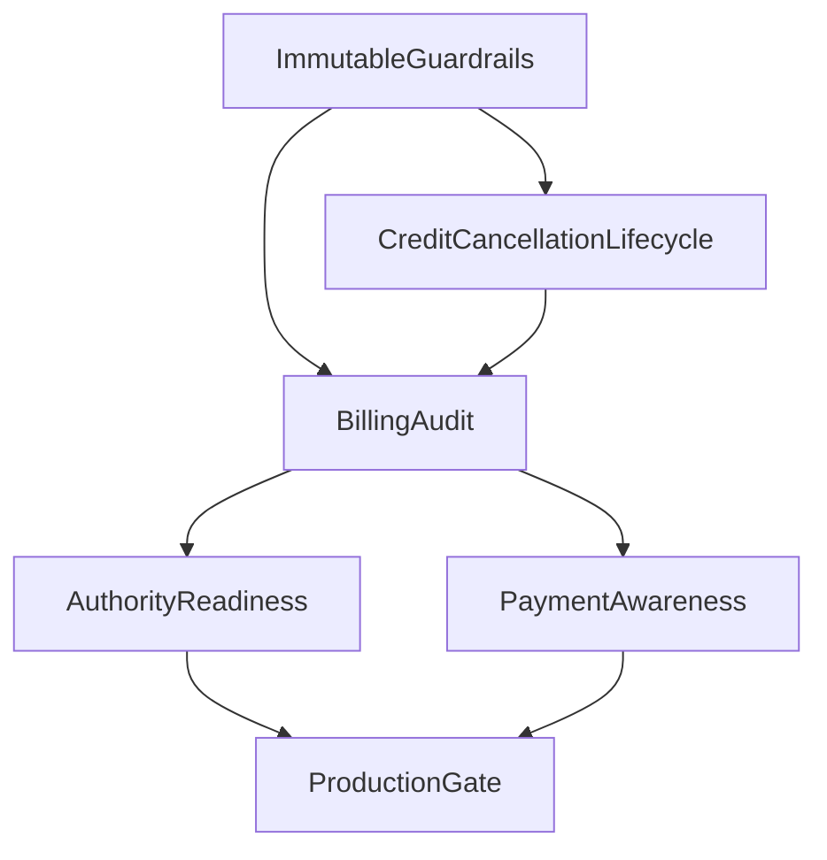

# Billing Compliance Implementation Plan v1

This document defines the safe implementation sequence for Billing compliance foundations.

It is not a migration, schema change, runtime implementation, UI redesign, or ERP expansion. It is the execution plan for future implementation work under `docs/billing-compliance-tax-authority-readiness-plan.md`.

## Source Of Truth

All phases in this document must follow:

- `docs/billing-compliance-tax-authority-readiness-plan.md`
- `docs/system-wide-ux-stage-aware-product-flow.md`

If this document conflicts with the compliance readiness plan, the compliance readiness plan wins.

## Goal

Build minimal serious compliance infrastructure for Billing so future work can support:

- immutable issued invoices
- legal reversal through credit/cancellation lifecycle
- auditability
- authority / SHAAM readiness
- archive permanence
- simple payment awareness

without turning Billing into a full accounting system.

## Recommended Implementation Order

1. Immutable issued guardrails
2. Legal reversal lifecycle
3. Dedicated Billing audit
4. Authority / SHAAM readiness
5. Payment awareness foundation

Do not start with payment or UI. Payment and UI depend on legal document permanence and auditability.

## Phase 1 — Immutable Issued Guardrails

### Why First

Every compliance foundation depends on the same invariant: once a tax invoice is issued, its legal content cannot change.

### Implementation Slice

Plan the first future implementation slice around:

- service-level mutation gates for issued documents
- a legal snapshot integrity marker
- explicit allowed post-issuance operational metadata
- blocking future direct mutation bugs

### Minimal Schema Additions

Future implementation should add only the smallest legal lock fields:

- `BillingDocument.lockedAt` or `BillingDocument.immutableAt`
- `BillingDocument.legalSnapshotHash`
- optional `BillingDocument.revision` for draft concurrency only

### Service Impact

Future implementation should review and guard:

- `lib/services/billing/billing-issue.service.ts`
- `lib/services/billing/billing-draft.service.ts`
- `lib/services/billing/billing-transition.service.ts`
- `app/api/billing/documents/[id]/route.ts`
- `app/api/billing/documents/[id]/lines/route.ts`

### Required Guardrails

- All Billing mutations must go through Billing domain services.
- Routes must not update `BillingDocument` or `BillingDocumentLine` directly for legal lifecycle changes.
- `ISSUED` must block legal-field mutation.
- Reverting `ISSUED` must remain impossible.
- Deleting issued documents or their lines must remain impossible.

### Must Never Be Mutable After Issue

- document type
- document number / formatted number
- issue timestamp and issuing user
- issued snapshot
- line items
- customer snapshot
- totals, VAT, currency
- legal references once created

### Can Remain Mutable

Only operational metadata:

- PDF render status/storage/hash metadata
- payment state
- authority submission state
- audit records

Every such mutation must be auditable.

### What Stays UI-Only

- lock badges
- confirmation text
- warning copy
- archive visual grouping

## Phase 2 — Legal Reversal Lifecycle

### Why Second

Legal mistakes must be corrected through lifecycle records, not by editing or deleting issued invoices.

### Implementation Slice

Plan the second future implementation slice around:

- credit-note document type
- reference relationship from credit note to original invoice
- no cancel/delete mutation of issued invoices
- archive display for linked legal records

### Minimal Schema Additions

- Add `CREDIT_NOTE` to `BillingDocumentType`.
- Add `BillingDocument.referenceDocumentId`.
- Consider void/cancel metadata only for non-issued or legally valid void flows.

### Lifecycle Rules

- `DRAFT`: editable, not legal.
- `PENDING_REVIEW`: must be defined before production as either editable review draft or locked approval candidate.
- `ISSUED`: immutable legal source document.
- `CREDIT_NOTE`: separate legal document referencing an issued invoice.
- `CANCELLED` / `VOIDED`: never erase issued tax invoices.

### Constraints

- Credit notes can only reference issued invoices in the same business.
- Issued credit notes are immutable.
- Credit-note reference relationship becomes immutable at issue.
- Credited total should be calculated from linked credit notes.

### Archive Behavior

- Original invoice remains visible.
- Credit note appears as its own row.
- Original invoice may show derived labels such as credited partially or credited fully.

### Can Wait

- Complex credit allocation across multiple invoices.
- Full void/cancel product flow.

### Phase 2 Completion Criteria

This phase is complete only when future implementation can answer all of these without ambiguity:

- How is an issued invoice legally reversed?
- Which document type represents the reversal?
- Which original invoice does the reversal reference?
- How is the original invoice kept immutable and visible?
- How does archive display the relationship without implying deletion?
- How is the reversal audited?

## Phase 3 — Dedicated Billing Audit

### Why Before Authority And Payment

Authority state, credit notes, and payment changes all need durable audit history. Generic telemetry is not enough.

### Implementation Slice

Plan the third future implementation slice around a dedicated append-only Billing audit path.

### Minimal Schema Additions

Add `BillingAuditEvent` with:

- `businessId`
- `billingDocumentId`
- `eventType`
- `actorUserId`
- `ipAddress`
- `userAgent`
- `occurredAt`
- `before`
- `after`
- `metadata`
- `eventHash`
- optional `previousEventHash`

### Critical Events

- draft created
- header changed
- lines changed
- submitted for review
- reverted to draft
- issued
- PDF rendered
- PDF render failed
- quote converted to invoice
- credit note created
- cancellation or void event
- payment status changed
- authority submission attempted
- authority accepted or rejected

### Constraints

- Billing audit events are append-only.
- Billing audit events are not user-deletable.
- Compliance-critical audit failures must not be silently swallowed like telemetry failures.

### Can Wait

- SIEM integration
- admin audit console
- advanced audit export filters

### Phase 3 Completion Criteria

This phase is complete only when future implementation has a dedicated legal audit path for:

- issue
- credit note creation
- authority submission state changes
- payment state changes
- PDF render success/failure
- legal lifecycle changes

Generic product telemetry may remain, but it must not be the only legal audit record.

## Phase 4 — Authority / SHAAM Readiness

### Why Fourth

Authority integration needs immutable legal payloads and audit foundations first.

### Implementation Slice

Plan the fourth future implementation slice around queryable authority state without implementing the external API yet.

### Minimal Schema Shape

Prefer a dedicated `BillingAuthoritySubmission` model over stuffing all fields into `BillingDocument`.

Minimum fields:

- `businessId`
- `billingDocumentId`
- `allocationNumber`
- `authoritySubmissionId`
- `authorityStatus`
- `authorityResponse`
- `authorityPayloadHash`
- `authoritySubmittedAt`
- `authorityApprovedAt`
- `authorityLastAttemptAt`
- `authorityErrorCode`
- `authorityErrorMessage`
- `authorityRetryCount`

Recommended statuses:

- `NOT_REQUIRED`
- `PENDING`
- `SUBMITTED`
- `APPROVED`
- `REJECTED`
- `FAILED`

### Immutable Authority Facts

Once accepted, these must never be mutated:

- allocation number
- authority approval reference
- submitted payload hash
- accepted authority response reference

### Can Wait

- SHAAM API client
- credential handling
- polling
- background retry workers
- webhooks

### Phase 4 Completion Criteria

This phase is complete only when future implementation can store and audit authority readiness data without calling an external API:

- allocation number placeholder or accepted value
- authority submission id
- authority status
- submitted payload hash
- raw/normalized authority response
- retry/error metadata
- submission timestamps

## Phase 5 — Payment Awareness Foundation

### Why Last

Payment awareness is useful, but it is operational metadata. It should not precede legal permanence, reversal lifecycle, or audit.

### Implementation Slice

Plan the fifth future implementation slice around invoice-level payment awareness only.

### Minimal Schema Additions

On tax invoices:

- `dueDate`
- `paymentStatus`
- `paidAmount`
- `paidAt`

Recommended statuses:

- `UNPAID`
- `PARTIALLY_PAID`
- `PAID`

### Calculated, Not Persisted Initially

- `openAmount = totalAmount - paidAmount`
- `overdue = dueDate < today && paymentStatus != PAID`
- paid percentage
- payment counters

### Constraints

- Payment changes only apply to issued invoices.
- `paidAmount` cannot be negative.
- `paidAmount` should not exceed invoice total unless overpayment support is intentionally designed later.
- Every manual payment state change must be audited.

### Outside Scope

- bank reconciliation
- payment matching
- ledger accounting
- chart of accounts
- payment gateway settlement logic

### Phase 5 Completion Criteria

This phase is complete only when future implementation supports invoice-level payment awareness without becoming an accounting subsystem:

- due date exists
- payment status exists
- paid amount exists
- paid timestamp exists when fully paid
- open amount is derived
- overdue is derived
- every manual payment change is audited

## Dependencies

- Credit notes depend on immutable issued invoices.
- Authority submission depends on legal snapshot integrity.
- Legal audit should exist before credit, payment, and authority state become production-enabled.
- Payment state depends on issued invoice permanence and audit.
- UI can continue only if it does not expose unsupported legal/payment/authority states.

## Minimal Schema Plan Summary

Future implementation should stay limited to:

- `BillingDocument.lockedAt` or `immutableAt`
- `BillingDocument.legalSnapshotHash`
- `BillingDocument.referenceDocumentId`
- `BillingDocument.dueDate`
- `BillingDocument.paymentStatus`
- `BillingDocument.paidAmount`
- `BillingDocument.paidAt`
- `BillingDocumentType.CREDIT_NOTE`
- `BillingAuthoritySubmission`
- `BillingAuditEvent`

Avoid accounting-ledger schemas unless a separate accounting product scope is approved.

## Dangerous Future Traps

- adding cancel invoice as a status mutation on issued invoices
- editing issued invoices to fix legal mistakes
- treating `PENDING_REVIEW` as both editable and approved
- storing allocation numbers only in snapshots or PDFs
- using `LearningEvent` as the only legal audit trail
- persisting `OVERDUE` and letting it drift from `dueDate`
- adding payment reconciliation before simple payment state is stable
- letting UI imply legal states that backend does not support

## Production Gate

Billing must not be considered legal invoice production-ready until:

- issued invoice immutability is enforced in services
- legal snapshot integrity is recorded
- legal reversal exists through credit lifecycle
- dedicated Billing audit exists for legal events
- authority readiness state exists outside PDF snapshots
- payment foundation exists if invoice management is advertised
- retention/export policy exists for issued documents, PDFs, and audit events

## What Can Safely Wait

- automated SHAAM integration
- bank reconciliation
- payment matching
- general ledger
- multi-currency accounting
- advanced collection workflows
- complex approval roles
- accountant back-office reports

## Non-Negotiable Boundary

Billing is a smart business document infrastructure. It must preserve legal document integrity and authority readiness without becoming an ERP or full accounting system.
