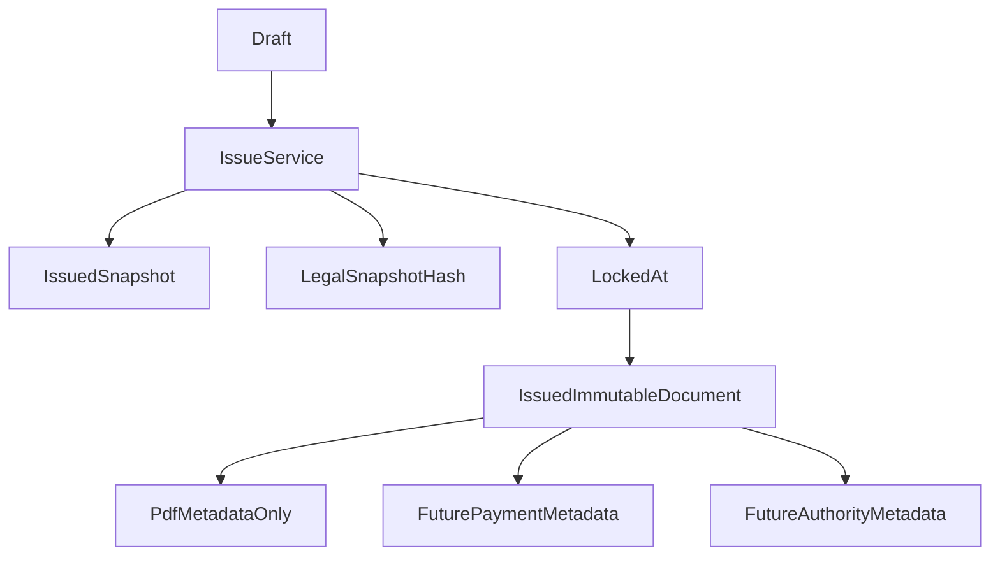

# Billing Compliance Foundation — Phase 1 Immutable Issued Review

This document is the final validation artifact before implementing Phase 1.

It does not implement schema changes, migrations, runtime behavior, or UI changes. It defines the minimal serious immutable foundation that future implementation must follow.

Source documents:

- `docs/billing-compliance-tax-authority-readiness-plan.md`
- `docs/billing-compliance-implementation-plan.md`

## Validation Result

Phase 1 should proceed only as an additive immutable foundation.

The current Billing runtime already has useful service-level intent:

- Invoice issuance is centralized in `lib/services/billing/billing-issue.service.ts`.
- Draft header and line edits are status-gated in `lib/services/billing/billing-draft.service.ts`.
- Submit/revert transitions are status-gated in `lib/services/billing/billing-transition.service.ts`.
- PDF services mutate operational PDF metadata rather than legal document content.

The gap is that issued immutability is still implicit. Phase 1 must make it explicit, centralized, and future-safe without introducing credit notes, payment fields, authority submission fields, dedicated audit schema, or UI redesign.

## Immutable After Issuance

After a document reaches `ISSUED`, these fields and relationships must never mutate:

- `documentType`
- `documentNumber`
- `documentNumberFormatted`
- `issuedAt`
- `issuedByUserId`
- `issuedSnapshot`
- `customerId`
- `customerNameSnapshot`
- all `BillingDocumentLine` rows for the document
- `subtotalAmount`
- `vatAmount`
- `totalAmount`
- `currency`
- future legal references once issued or accepted

The legal source of truth is the frozen `issuedSnapshot`, not live joined business, customer, or line data.

## Mutable After Issuance

Only operational metadata may remain mutable after issuance:

- `pdfRenderStatus`
- `pdfStorageKey`
- `pdfHash`
- `pdfRenderedAt`
- `pdfRenderError`
- future payment fields
- future authority submission fields
- future audit records

These mutations must go through explicit services and must be audit-ready. They are not legal content.

## Snapshot-Only Legal Representation

Issued invoice PDF, legal export, and legal display must read from `issuedSnapshot` for:

- issuer details at issuance
- customer details at issuance
- line descriptions, quantities, prices, and VAT rates
- totals
- document number
- issue timestamp
- PDF template style at issuance

Changes to `BusinessProfile`, `Customer`, draft lines, or future styling defaults must not alter the legal meaning of an issued invoice.

## Current Mutation Surfaces To Guard

Current code is mostly safe, but Phase 1 implementation must explicitly guard these mutation points:

- `lib/services/billing/billing-draft.service.ts`
  - `updateBillingDraftHeader`
  - `replaceBillingDraftLines`
  - internal line replacement and total recomputation
- `lib/services/billing/billing-transition.service.ts`
  - submit draft for review
  - revert pending review to draft
- `lib/services/billing/billing-issue.service.ts`
  - the legal issuance boundary
  - document number assignment
  - issued snapshot creation
  - future lock/hash assignment
- `lib/services/billing/convert-quote-to-invoice.service.ts`
  - quote conversion relationship
  - creation of invoice draft from quote
- `lib/services/billing/quote-document-number.ts`
  - safe for quote numbering, but must not become a backdoor for issued invoice renumbering
- Billing PDF services
  - may update only PDF operational metadata

## Dangerous Future Mutation Paths

Phase 1 guardrails must prevent these future bugs:

- direct `prisma.billingDocument.update` calls that modify issued legal fields
- direct `prisma.billingDocumentLine` mutations on issued documents
- generic document update routes that accept legal and operational fields together
- reuse of draft services for issued documents
- line replacement or total recomputation after issuance
- status mutation from `ISSUED` back to `DRAFT` or `PENDING_REVIEW`
- cancel/void behavior implemented as mutation on the original issued invoice
- payment or authority services accidentally allowing legal-field updates

## Centralized Issuance Gate

Keep `issueBillingDocument()` as the only issuance path.

Phase 1 implementation should add small domain helpers, not a workflow engine:

- guard legal-field mutation by status
- define an allowlist for post-issued operational metadata
- require all legal lifecycle changes to go through Billing services
- compute and persist legal snapshot integrity at issuance

## Application-Level Guardrails

These can remain application-level in Phase 1:

- status transition validation
- legal-field mutation allowlist
- post-issued operational metadata allowlist
- draft services rejecting `ISSUED`
- PDF services restricted to PDF metadata
- `PENDING_REVIEW` policy until product decides whether it is editable review draft or locked approval candidate

Do not add a generic workflow engine. Keep the guardrails local, explicit, and testable.

## Minimal Schema Impact

Phase 1 should add only two nullable fields to `BillingDocument`:

- `lockedAt DateTime?`
- `legalSnapshotHash String?`

Use `lockedAt` as the preferred name. It is product-readable and should be documented as the legal lock timestamp.

Do not add these in Phase 1:

- credit-note document type
- payment fields
- authority submission fields
- dedicated audit model
- cancellation statuses
- DB triggers
- broad lifecycle enum redesign

## Migration Safety

The safest migration path is additive and nullable:

1. Add nullable `lockedAt` and `legalSnapshotHash`.
2. Preserve current runtime behavior during migration deployment.
3. Backfill existing `ISSUED` documents:
   - `lockedAt = issuedAt` when `issuedAt` exists.
   - `legalSnapshotHash = hash(canonical issuedSnapshot)` when `issuedSnapshot` exists.
4. New issuance should set both fields at the legal boundary.
5. Service guardrails should treat `status === ISSUED` as immutable even when old rows have null lock fields.

No destructive migration. No enum changes. No existing PDF or snapshot rewrite.

## Backward Compatibility

Existing issued documents may not have Phase 1 fields yet.

Compatibility rules:

- `status === ISSUED` remains the core immutability signal.
- `lockedAt` strengthens the invariant; it does not define it alone.
- `legalSnapshotHash` strengthens integrity; absence on old rows should not break PDF rendering.
- Existing `issuedSnapshot` schema version remains valid.
- Existing archive/list APIs should continue to work.
- Existing numbering sequence behavior must remain unchanged.

## Runtime Parts That Must Not Break

Do not break:

- draft creation
- draft header editing
- draft line editing
- quote creation
- quote PDF generation
- quote to invoice conversion
- invoice issuance
- PDF render/cache behavior
- existing archive/list APIs
- current `issuedSnapshot` schema version
- `BillingDocumentNumberSequence`
- `@@unique([businessId, documentType, documentNumber])`

## Future Layers On Phase 1

Future foundations should attach to Phase 1 without redesign:

- Credit notes reference immutable issued invoices.
- Authority submissions hash immutable legal payloads.
- Payment state updates operational metadata only.
- Audit records describe legal and operational mutations without changing legal content.

## Phase 1 Implementation Boundary

When implementation begins, include only:

- add `lockedAt`
- add `legalSnapshotHash`
- compute legal snapshot hash during issuance
- backfill existing issued rows safely
- add centralized mutation guard helpers
- apply guards to draft/header/line/transition services
- keep PDF metadata updates explicitly allowed
- add focused tests for issued mutation blocking and draft behavior preservation

Do not include:

- credit notes
- payment awareness
- authority readiness fields
- dedicated Billing audit model
- UI redesign
- ERP/accounting concepts

