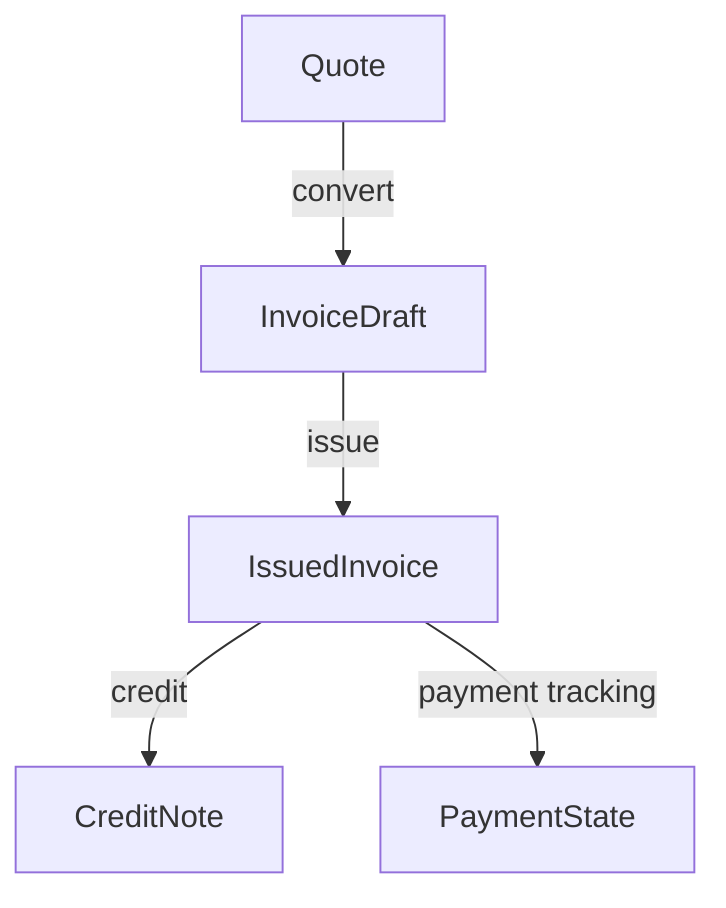

# Billing Compliance & Tax Authority Readiness Plan (Israel) — v1

This document is the mandatory source of truth for future Billing/Invoices work.

It defines the minimal serious compliance foundation for a smart business document system. It is not an ERP plan, accounting engine plan, or frontend redesign brief.

## Scope

Applies to Billing code, schema planning, APIs, document lifecycle, PDFs, quote-to-invoice conversion, archive behavior, audit events, payment awareness, and future Tax Authority / SHAAM readiness.

## Current Foundation

Billing already has meaningful document infrastructure:

- Issued invoices are created through a dedicated issue service.
- Issuance freezes a legal `issuedSnapshot`.
- Document numbers are allocated per business and document type.
- A unique constraint protects `businessId + documentType + documentNumber`.
- Quotes and invoices are separated, and quote conversion creates a new invoice.
- Rendered PDFs have storage keys and hashes.
- Key lifecycle actions write audit-style events.

These foundations should be preserved. Future work should strengthen them, not replace them.

## Priority 1 — Immutable Issued Guardrails

`ISSUED` is a legal boundary.

After a tax invoice is issued, these fields and relationships must never be mutated:

- `documentType`
- `documentNumber`
- `documentNumberFormatted`
- `issuedAt`
- `issuedByUserId`
- `issuedSnapshot`
- customer snapshot fields
- line items
- totals
- VAT values
- currency
- legal reference relationships, once issued

Allowed post-issuance changes are limited to operational metadata:

- PDF render state, storage key, hash, render timestamp, and render error.
- Payment tracking fields.
- Authority submission fields.
- Audit records.

All allowed post-issuance changes must be auditable.

### Required Guardrails

- All Billing mutations must go through Billing domain services.
- Routes must not update `BillingDocument` or `BillingDocumentLine` directly for legal lifecycle changes.
- Future services must explicitly reject mutation of issued legal fields.
- Reverting `ISSUED` to `DRAFT` or `PENDING_REVIEW` must remain forbidden.
- Deleting issued documents or their lines must remain forbidden.

### Pending Review Rule

`PENDING_REVIEW` must be defined precisely before production:

- If it means "editable review draft", it can remain editable but must not be treated as approved.
- If it means "approval candidate", content should be locked until reverted.

Do not blur this state in future UI or service logic.

## Priority 2 — Cancellation / Credit Lifecycle

Legal reversal must be represented through documents and references, not deletion.

### Recommended Lifecycle

- `DRAFT`: editable, not legal.
- `PENDING_REVIEW`: pre-issue review state; editability depends on the chosen rule above.
- `ISSUED`: legal source document, immutable.
- `CREDIT_NOTE`: separate legal document referencing an issued invoice.
- `CANCELLED` / `VOIDED`: only for non-issued artifacts or legally valid void flows. Do not use this to erase issued tax invoices.

### Credit Notes

Credit notes should be separate documents, not a status on the original invoice.

Minimum future relationship:

### Archive Behavior

- The original issued invoice remains visible forever.
- Credit notes appear as their own legal rows.
- The original invoice may show derived markers such as "credited partially" or "credited fully".
- No UI should offer "delete invoice" or ambiguous "cancel invoice" until the legal lifecycle exists.

## Priority 3 — Payment Awareness Foundation

Payment awareness is allowed. Full accounting is not.

Minimum future fields:

- `dueDate`
- `paymentStatus`
- `paidAmount`
- `paidAt`

Recommended payment statuses:

- `UNPAID`
- `PARTIALLY_PAID`
- `PAID`

Recommended calculated states:

- `openAmount = totalAmount - paidAmount`
- `overdue = dueDate < today && paymentStatus != PAID`

Do not persist `openAmount` or `OVERDUE` unless reporting/performance later requires it.

### Product Boundary

Allowed:

- show due date
- show paid/unpaid/partial/overdue
- allow simple manual payment marking
- show open amount calmly

Not allowed as part of this foundation:

- bank reconciliation
- ledger
- chart of accounts
- accounting reports
- automatic payment matching

## Priority 4 — Authority / SHAAM Readiness

Billing must be future-ready for Tax Authority integration without implementing the API now.

Future authority readiness needs queryable and auditable data, not only snapshot placeholders.

Recommended future fields/model:

- `allocationNumber`
- `authoritySubmissionId`
- `authorityStatus`
- `authorityResponse`
- `authorityPayloadHash`
- `authoritySubmittedAt`
- `authorityApprovedAt`
- `authorityLastAttemptAt`
- `authorityErrorCode`
- `authorityErrorMessage`
- `authorityRetryCount`

Recommended statuses:

- `NOT_REQUIRED`
- `PENDING`
- `SUBMITTED`
- `APPROVED`
- `REJECTED`
- `FAILED`

Prefer a dedicated authority submission model if retries or multiple attempts need to be preserved.

### Immutable Authority Values

Once accepted, these must never be mutated:

- allocation number
- authority approval reference
- submitted payload hash
- accepted authority response reference

Corrections must be represented through additional lifecycle records, not mutation.

## Priority 5 — Audit Infrastructure

Generic product telemetry is not enough for legal Billing events.

Future Billing audit should be dedicated, non-user-deletable, and retained with legal documents.

Minimum audit fields:

- `businessId`
- `billingDocumentId`
- `eventType`
- `actorUserId`
- `ipAddress`
- `userAgent`
- `occurredAt`
- `before`
- `after`
- `metadata`
- `eventHash`
- optional `previousEventHash`

### Critical Audit Events

- draft created
- header changed
- lines changed
- submitted for review
- reverted to draft
- issued
- PDF rendered
- PDF render failed
- quote converted to invoice
- credit note created
- cancellation or void event
- payment status changed
- authority submission attempted
- authority accepted or rejected

Compliance-critical audit writes should not silently disappear. Telemetry may be best-effort; legal audit should not be.

## Minimal Future Schema Additions

Do not add these casually. They are the intended foundation shape when implementation begins:

- expanded legal lifecycle or separate lifecycle status
- `referenceDocumentId`
- `legalSnapshotHash`
- `lockedAt` or `immutableAt`
- `dueDate`
- `paymentStatus`
- `paidAmount`
- `paidAt`
- authority submission model or equivalent authority fields
- dedicated Billing audit model

## Foundation Sequence

Implement future compliance foundations in this order:

1. **Immutable issued guardrails**
   - Define issued-field immutability in domain services.
   - Add legal snapshot hashing.
   - Ensure future routes cannot mutate issued legal fields.

2. **Credit and cancellation lifecycle**
   - Add legal reversal concepts before any cancel/void UI.
   - Introduce credit-note relationships before supporting invoice correction flows.
   - Keep original invoices permanent.

3. **Dedicated audit**
   - Add Billing-specific audit events before expanding legal actions.
   - Stop relying on generic telemetry for compliance-critical changes.
   - Capture actor, request context, before/after, and event hashes where needed.

4. **Authority readiness**
   - Add authority submission fields/model before SHAAM API implementation.
   - Store payload hashes and authority references as immutable records.
   - Design retry/error states before adding external submission calls.

5. **Payment awareness**
   - Add invoice-level payment state after legal document permanence is protected.
   - Keep overdue/open amount calculated unless persistence is clearly needed.
   - Do not expand into reconciliation or ledger behavior.

UI improvements may continue in parallel only if they do not imply unsupported legal capabilities.

## Production Gate

Billing is not production-ready for legal invoice use until all of these are true:

- Issued invoices cannot be edited, deleted, reverted, or renumbered.
- Legal reversal is modeled through credit/cancellation lifecycle, not mutation.
- A dedicated audit path exists for legal Billing events.
- Authority readiness fields or model exist, even if SHAAM API integration is not implemented.
- Payment foundation exists if UI claims invoice management.
- Retention/export policy exists for issued documents, PDFs, and audit records.

### Must Not Ship As Legal Invoice Production

Do not treat Billing as legal-production-ready if any of these are still true:

- Issued invoice immutability exists only as UI behavior.
- Generic telemetry is the only audit mechanism.
- There is no legal reversal path for issued invoices.
- Authority allocation/reference data cannot be stored outside a PDF snapshot.
- Issued invoices can be deleted through cascade behavior without retention/export policy.
- UI exposes "cancel", "delete", "paid", "overdue", or "submitted to authority" states that are not backed by domain state.

## Safe To Defer

- Full reconciliation.
- Bank matching.
- General ledger.
- Multi-currency accounting.
- Advanced collection workflows.
- Automated SHAAM API implementation.
- Complex approval roles, unless required by product before launch.

## Non-Negotiable Rule

Future Billing work must preserve legal document permanence first. If a feature requires mutating an issued invoice, the feature design is wrong.
