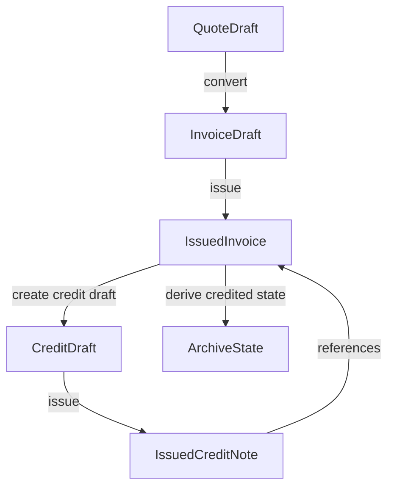

# Billing Credit / Cancellation Architecture Plan

This document defines the planned legal reversal lifecycle for Billing.

It is a planning artifact only. It does not implement schema changes, migrations,
runtime behavior, UI behavior, accounting flows, or ERP concepts.

## Source Documents

This plan extends:

- `docs/billing-compliance-tax-authority-readiness-plan.md`
- `docs/billing-compliance-implementation-plan.md`
- `docs/billing-compliance-phase-1-immutable-issued-review.md`

If this document conflicts with the compliance readiness plan, the compliance
readiness plan wins.

## Goal

Billing must support legal correction and reversal without mutating issued
documents.

Allowed goal:

- correct an issued invoice through a linked reversal document
- support full credit and partial credit
- keep the original invoice permanent and immutable
- make archive relationships clear
- stay audit-ready and tax-authority-ready

Not allowed in this phase:

- editing issued invoices
- deleting issued invoices
- reopening issued invoices as drafts
- mutating invoice totals to represent credit
- adding ledger, reconciliation, or ERP accounting behavior

## Recommended Reversal Model

Use reversal documents, not status mutation on the original invoice.

Recommended model:

- Add `CREDIT_NOTE` as a future `BillingDocumentType`.
- A credit note starts as an editable draft.
- A credit note becomes immutable when issued.
- The original invoice remains `ISSUED`.
- The credit note references exactly one original issued invoice.
- Partial and full credited states are derived from issued credit notes.

The product should use language such as "create credit note" or "create
correction document". It should not use destructive language such as "undo",
"erase", or "delete invoice".

## Minimal Lifecycle States

Do not add credit-specific statuses in the first implementation.

Use document type plus existing lifecycle status:

- `BillingDocumentType.TAX_INVOICE`
- `BillingDocumentType.QUOTE`
- `BillingDocumentType.CREDIT_NOTE`
- `BillingDocumentStatus.DRAFT`
- `BillingDocumentStatus.PENDING_REVIEW`
- `BillingDocumentStatus.ISSUED`

This gives the minimum legal lifecycle:

- `CREDIT_NOTE + DRAFT`: editable credit draft.
- `CREDIT_NOTE + PENDING_REVIEW`: optional review state, subject to the same
  production decision as invoices.
- `CREDIT_NOTE + ISSUED`: immutable legal credit note.

Do not add `CREDIT_DRAFT` or `CREDIT_ISSUED`. They duplicate information already
represented by `documentType + status`.

Before production, `PENDING_REVIEW` must be defined consistently:

- either editable review draft, clearly not approved
- or approval candidate, not editable until reverted

It must not mean both.

## Reference Relationship

Minimal relationship:

- `BillingDocument.referenceDocumentId Int?`
- For `CREDIT_NOTE`, `referenceDocumentId` points to the source issued
  `TAX_INVOICE`.
- One invoice can have many credit notes.
- One credit note references exactly one invoice.
- The reference must be within the same business.
- The reference becomes immutable when the credit note is issued.

Recommended domain rules:

- A credit note can only reference an `ISSUED` tax invoice.
- A credit note cannot reference a quote.
- A credit note cannot reference another credit note in the first version.
- A credit note cannot be issued without `referenceDocumentId`.
- A credit note should include source invoice reference facts in its
  `issuedSnapshot`.

The first version does not need a separate allocation table. One-to-many invoice
to credit-note references are enough for multiple partial credits.

## Cancellation Rules

Use precise language and avoid ambiguous legal states.

Recommended v1 policy:

- `DELETED` is not a legal state. It must never apply to issued invoices or
  issued credit notes.
- `CANCELLED` should not be added for issued tax invoices in v1. It is ambiguous
  and easily becomes a mutation shortcut.
- `VOIDED` should not be added in v1 unless there is a concrete legal
  requirement and a strict domain definition.
- `CREDITED` should not be persisted as an invoice status initially. It should
  be derived from linked issued credit notes.

Minimal correction model:

- Before issuance: edit the draft.
- After issuance: create a credit note.
- If a replacement invoice is needed, issue a new corrected invoice after the
  credit note.
- The original invoice remains visible and immutable forever.

## Derived Financial States

Do not mutate original invoice totals to represent credit.

Derived values for an issued invoice:

- `creditedAmount = sum(totalAmount of issued credit notes referencing invoice)`
- `remainingAmount = invoice.totalAmount - creditedAmount`
- `isPartiallyCredited = creditedAmount > 0 && creditedAmount < invoice.totalAmount`
- `isFullyCredited = creditedAmount >= invoice.totalAmount`
- `creditNoteCount = count(issued credit notes referencing invoice)`

Keep these derived initially:

- credited amount
- remaining amount
- partially credited
- fully credited
- credit count

Do not persist these in v1 unless performance later proves it is necessary:

- cached credited totals
- denormalized archive credited status

If caching is added later, it must be recalculated from issued credit notes and
audited. The source of truth remains the issued credit-note documents.

Guardrails:

- Only `CREDIT_NOTE + ISSUED` documents count toward credited totals.
- Draft credit notes do not affect credited state.
- Credit currency must match the source invoice in v1.
- Total credited amount should not exceed invoice total unless over-credit
  support is explicitly designed later.
- VAT and totals should use the same totals engine used by invoices.

## Archive Relationships

Archive should communicate business memory clearly without becoming an
accounting dashboard.

Archive behavior:

- The original invoice row remains visible.
- Credit notes appear as independent legal rows.
- Credit note rows show which invoice they credit.
- Original invoice rows may show derived labels:
  - "Has credit note"
  - "Partially credited"
  - "Fully credited"
- Invoice detail should show a compact legal history section with linked credit
  notes.
- Credit note detail should show the referenced source invoice.

Do not hide the original invoice. Do not replace it with the credit note. Do not
show the original invoice as "cancelled" unless a future domain model defines
that state precisely.

## Numbering

Credit notes should use their own sequence.

Recommended direction:

- Reuse `BillingDocumentNumberSequence`.
- Because the sequence key is `businessId + documentType`, adding `CREDIT_NOTE`
  creates a separate sequence naturally.
- Credit notes get their own `documentNumber` and `documentNumberFormatted`.
- Do not reuse the source invoice number.
- Do not share the invoice sequence unless accountant or legal guidance requires
  one combined series.

The architecture should support per-document-type sequencing without hardcoding
final tax-authority policy into UI copy.

## Immutability

Issued credit notes must be immutable like issued invoices.

Editable before credit-note issuance:

- referenced invoice, while the credit note is still draft
- customer snapshot if the credit-note creation policy allows it
- lines
- totals
- VAT values
- legal notes that will be included in the snapshot

Immutable after credit-note issuance:

- `documentType`
- `documentNumber`
- `documentNumberFormatted`
- `issuedAt`
- `issuedByUserId`
- `issuedSnapshot`
- `lockedAt`
- `legalSnapshotHash`
- `referenceDocumentId`
- customer snapshot
- lines
- totals
- VAT values
- currency

Allowed mutable metadata after issuance:

- PDF render metadata
- future authority metadata
- audit records

Payment metadata for credit notes should not be introduced in v1 unless the
product explicitly needs it.

## UX Direction

No UI implementation is included in this plan.

Future UX should feel calm, guided, and non-destructive:

1. User opens an issued invoice.
2. The legal action is "Create credit note", not "Edit" or "Delete".
3. UI explains that the original invoice remains unchanged.
4. User chooses full credit or partial credit.
5. Full credit can prefill lines from the source invoice.
6. Partial credit lets the user edit the credit draft lines.
7. User reviews and issues the credit note.
8. Archive shows both documents and their relationship.

Avoid panic language and destructive confirmation patterns. The workflow should
feel like creating a controlled correction document, not undoing history.

## Dangerous Traps

Do not introduce:

- "cancel invoice" as a direct status mutation on issued invoices
- reopening issued invoices as drafts
- deleting issued invoices or issued credit notes
- editing issued invoice totals after credit
- persisted credited status before deriving it from legal documents
- draft credit notes affecting credited totals
- credit notes referencing quotes
- credit notes referencing invoices from another business
- over-credit behavior without explicit policy
- invoice number reuse for credit notes
- generic `LearningEvent` as the only legal audit path for credit-note issuance
- ledger or reconciliation concepts before reversal lifecycle is stable

Edge cases to define before implementation:

- multiple partial credit notes on one invoice
- full credit after previous partial credits
- attempted credit amount greater than remaining invoice amount
- credit draft created, then another credit note is issued first
- PDF render failure after credit-note issuance
- old issued invoices with null `lockedAt` or `legalSnapshotHash`
- quote converted to invoice, then the invoice is credited

## Minimal Schema Direction

Planning only. Do not implement now.

Likely minimal future additions:

- add `CREDIT_NOTE` to `BillingDocumentType`
- add `referenceDocumentId Int?` to `BillingDocument`
- add a self-relation from credit note to referenced invoice
- add `@@index([businessId, referenceDocumentId])`
- consider `@@index([businessId, documentType, status])` if archive queries need it

Probably not needed in v1:

- separate `CreditNote` table
- credit allocation table
- persisted credited status
- cancellation enum
- void enum
- ledger entries
- reconciliation tables
- approval workflow tables

Dedicated `BillingAuditEvent` should be planned alongside or immediately after
this phase, because credit-note creation and issuance are legal lifecycle events.

## Production Risks

Billing remains blocked for legal production reversal until these exist:

- `CREDIT_NOTE` document type
- immutable reference from credit note to source invoice
- derived credited state
- credit-note issuance through the legal issuance boundary
- dedicated Billing audit for credit-note lifecycle
- archive read model for invoice and credit-note relationships
- guardrails for same-business references, issued-source invoice, currency, and
  over-credit policy

The most dangerous gaps to postpone are:

- credit-note lifecycle
- reference relationship
- legal audit for credit-note issuance
- derived credited calculations

## Recommended Implementation Order

When implementation is approved, use this order:

1. Confirm domain rules:
   - use `CREDIT_NOTE + DRAFT/PENDING_REVIEW/ISSUED`
   - do not add `CANCELLED` or `VOIDED` in v1
   - define over-credit policy
2. Add minimal schema:
   - `CREDIT_NOTE`
   - `referenceDocumentId`
   - self-relation and focused indexes
3. Add credit draft creation service:
   - create from issued source invoice
   - support full credit prefill
   - support partial credit editing as draft lines
   - enforce same-business and issued-source rules
4. Add credit-note issuance:
   - allocate credit-note number
   - build credit-note `issuedSnapshot`
   - include source invoice reference facts
   - set `lockedAt` and `legalSnapshotHash`
   - apply immutable guardrails
5. Add derived credited read service:
   - credited amount
   - remaining amount
   - partial/full credited labels
   - count only issued credit notes
6. Add legal audit slice:
   - credit draft created
   - credit note issued
   - credit-note PDF rendered or failed
7. Extend archive/API read model:
   - include reference relationship
   - include derived credited labels
   - do not add destructive cancellation UI
8. Implement UX later:
   - calm credit-note creation flow
   - linked legal history
   - archive relationship labels

## Safe To Wait

These can wait:

- void flow
- cancellation status
- cross-invoice credit allocation
- complex credit allocation by line
- accounting reports
- ledger and reconciliation
- automatic tax authority submission
- accountant report suite
- complex approval hierarchies

## Outside Billing Scope

Keep these outside this lifecycle foundation:

- general ledger
- chart of accounts
- bank reconciliation
- automatic payment matching
- tax filing engine
- ERP cancellation workflows
- broad accountant back-office reporting

## Final Recommendation

The minimal serious legal reversal foundation is:

- `CREDIT_NOTE` as a first-class `BillingDocumentType`
- one immutable source invoice reference through `referenceDocumentId`
- original invoice remains immutable and visible
- credited state is derived from issued credit notes
- no `CANCELLED` or `VOIDED` in v1
- no ledger, reconciliation, or ERP behavior

This gives Billing a legal correction path without turning it into an accounting
system.
