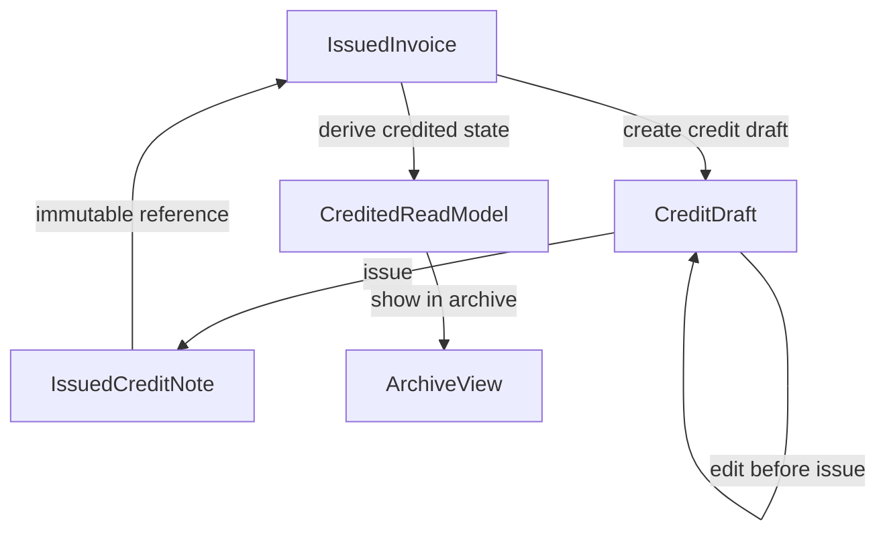

# Billing Credit / Cancellation Implementation Planning Review

This document translates the legal reversal architecture into a safe future
implementation plan.

It is a planning artifact only. It does not implement schema changes, migrations,
runtime behavior, UI behavior, refactors, accounting flows, or ERP concepts.

## Source Documents

This review depends on:

- `docs/billing-compliance-tax-authority-readiness-plan.md`
- `docs/billing-compliance-implementation-plan.md`
- `docs/billing-compliance-phase-1-immutable-issued-review.md`
- `docs/billing-credit-cancellation-architecture-plan.md`

If this document conflicts with the compliance readiness plan, the compliance
readiness plan wins.

## Current Baseline

Billing already has the required Phase 1A foundation for a safe reversal layer:

- issued invoices are created through a centralized issuance service
- issued documents have `issuedSnapshot`
- issued documents have `lockedAt`
- issued documents have `legalSnapshotHash`
- document numbers are allocated by `BillingDocumentNumberSequence`
- quote to invoice conversion creates a separate invoice draft
- issued legal fields are guarded against mutation
- PDF metadata is operational and separate from legal content

The next implementation must stay additive-only and build legal reversal through
documents, not mutation.

## Recommended Minimal Reversal Model

Use `CREDIT_NOTE` as a separate legal document type.

The source invoice remains:

- `documentType = TAX_INVOICE`
- `status = ISSUED`
- immutable forever

The reversal document is:

- `documentType = CREDIT_NOTE`
- `status = DRAFT`, `PENDING_REVIEW`, or `ISSUED`
- linked to exactly one source issued invoice
- immutable after issuance

Do not introduce these in the first implementation:

- `CANCELLED`
- `VOIDED`
- `CREDIT_DRAFT`
- `CREDIT_ISSUED`
- persisted `CREDITED`

`CREDIT_NOTE + DRAFT/PENDING_REVIEW/ISSUED` is enough for the first legal
reversal foundation.

## Minimal Schema Additions

The minimal schema direction is:

- add `CREDIT_NOTE` to `BillingDocumentType`
- add nullable `referenceDocumentId Int?` to `BillingDocument`
- add a self-relation from a credit note to the referenced invoice
- add an inverse relation from an invoice to its credit notes
- add `@@index([businessId, referenceDocumentId])`

Potential archive query support:

- consider `@@index([businessId, documentType, status])` only if future archive
  queries need it

Do not add these in the first implementation:

- `creditReason`
- `creditedAt`
- `reversalType`
- `creditedAmount`
- `remainingAmount`
- `creditStatus`
- `cancelledAt`
- `voidedAt`
- separate `CreditNote` table
- credit allocation table
- ledger tables
- reconciliation tables

### Why These Fields Stay Out

`creditReason` can be captured in future draft input and frozen into
`issuedSnapshot` if product or legal requirements need it. It is not required for
the structural reversal relationship.

`creditedAt` is not reliable as a single field because one invoice can have many
credit notes. The meaningful timestamps are the `issuedAt` values of the linked
credit notes.

`reversalType` is unnecessary in v1 because the only supported reversal type is
credit note. Full versus partial credit is derived from the amount.

`creditedAmount`, `remainingAmount`, and `creditStatus` must not be persisted in
v1 because they can drift from the legal source documents.

## Derived Vs Persisted

Persist legal documents and immutable relationships only.

Persisted source of truth:

- original issued invoice
- issued credit notes
- `referenceDocumentId`
- each document's `issuedSnapshot`
- each document's `legalSnapshotHash`
- each document's `lockedAt`

Derived read-model values:

- `creditedAmount`
- `remainingAmount`
- `isPartiallyCredited`
- `isFullyCredited`
- `creditNoteCount`
- archive label: "has credit note"
- archive label: "partially credited"
- archive label: "fully credited"

Derived formulas:

- `creditedAmount = sum(totalAmount of CREDIT_NOTE + ISSUED documents where referenceDocumentId = invoice.id)`
- `remainingAmount = invoice.totalAmount - creditedAmount`
- `isPartiallyCredited = creditedAmount > 0 && creditedAmount < invoice.totalAmount`
- `isFullyCredited = creditedAmount >= invoice.totalAmount`
- `creditNoteCount = count(CREDIT_NOTE + ISSUED documents where referenceDocumentId = invoice.id)`

If performance later requires cached values, they must be treated as rebuildable
read-model cache, not legal truth.

## Lifecycle Rules

### Credit Draft Creation

Rules:

- source document must belong to the same business
- source document must be `TAX_INVOICE + ISSUED`
- source document must not be `QUOTE`
- source document must not be `CREDIT_NOTE`
- source invoice must not be mutated
- credit draft should copy source customer snapshot, currency, relevant line
  facts, and source invoice reference facts

Full credit:

- may prefill all source invoice lines
- total should match remaining amount unless previous partial credits exist

Partial credit:

- starts as editable credit draft lines
- must be validated against remaining source invoice amount at issue time

### Credit Draft Editing

Editable before issuance:

- credit lines
- totals through line recomputation
- customer snapshot if product policy allows it
- legal note/reason if introduced later
- `referenceDocumentId` while still draft

The source invoice remains immutable during all draft editing.

### Credit Note Issuance

Issuance must follow the same legal boundary as invoices:

- allocate a number from the `CREDIT_NOTE` sequence
- validate source invoice is still same-business `TAX_INVOICE + ISSUED`
- validate credit amount does not exceed remaining amount
- validate currency matches source invoice
- build an `issuedSnapshot`
- include source invoice reference facts in the snapshot
- set `issuedAt`
- set `issuedByUserId`
- set `lockedAt`
- compute and set `legalSnapshotHash`
- set `pdfRenderStatus` to pending

Credit-note issuance must not update source invoice legal fields or totals.

### After Issuance

Immutable after credit-note issuance:

- `documentType`
- `documentNumber`
- `documentNumberFormatted`
- `issuedAt`
- `issuedByUserId`
- `issuedSnapshot`
- `lockedAt`
- `legalSnapshotHash`
- `referenceDocumentId`
- customer snapshot
- lines
- totals
- VAT values
- currency

Mutable after issuance:

- PDF render metadata
- future authority metadata
- future legal audit records

Payment metadata for credit notes should wait unless the product explicitly
needs it.

### Multiple Credits

Allowed:

- multiple issued credit notes can reference one source invoice
- partial credit can be followed by another partial credit
- partial credit can be followed by a final credit up to remaining amount

Rejected in v1:

- over-credit
- cross-currency credit
- credit note referencing another credit note
- credit note referencing a quote
- credit note referencing another business's invoice

## Cancellation Semantics

For issued invoices, "cancel" should mean "create credit note".

Do not add `CANCELLED` or `VOIDED` in the first implementation.

Use these meanings for future discussion only:

- `CANCELLED`: possible future state for non-issued artifacts or a specific
  legally valid cancellation flow
- `VOIDED`: possible future state only if legal/accountant guidance requires a
  strict void process
- `DELETED`: never a legal state for issued invoices or issued credit notes
- `CREDITED`: derived label, not persisted status

## Guardrails And Edge Cases

Required guardrails:

- reject credit note creation for quotes
- reject credit note creation for credit notes
- reject credit note creation across businesses
- reject credit note issuance without `referenceDocumentId`
- reject over-credit based on currently issued linked credit notes
- reject currency mismatch
- reject source invoice mutation during credit creation or issuance
- exclude draft credit notes from credited calculations
- treat old issued invoices with null `lockedAt` or `legalSnapshotHash` as
  immutable by `status === ISSUED`

Dangerous edge cases:

- double credit from concurrent issue attempts
- over-credit after another credit note is issued first
- full credit after previous partial credits
- stale credit draft based on old remaining amount
- credit on quote
- credit loop through credit note references
- linked record deletion
- numbering conflict in credit-note sequence
- draft credit note accidentally shown as reducing invoice amount
- persisted credited status drifting from linked legal records

Concurrency rule:

- final over-credit validation must happen inside the credit-note issuance
  transaction, using currently issued credit notes for the source invoice

## Archive Relationship Direction

Archive should show legal memory clearly:

- source invoice remains visible permanently
- credit notes appear as independent rows
- credit notes show which invoice they credit
- source invoice shows derived labels:
  - has credit note
  - partially credited
  - fully credited
- invoice detail can show linked credit notes
- credit note detail can show the referenced source invoice

Archive must not hide, replace, delete, or mark the source invoice as cancelled in
v1.

## Migration Strategy

Future migration must be additive-only:

1. Add `CREDIT_NOTE` enum value.
2. Add nullable `referenceDocumentId`.
3. Add self-relation and inverse relation.
4. Add focused index on `businessId + referenceDocumentId`.
5. Do not backfill existing rows.
6. Keep existing invoice, quote, PDF, and archive flows working with null
   references.

Migration must not:

- remove enum values
- change existing enum meaning
- add required columns
- rewrite `issuedSnapshot`
- renumber documents
- change existing route contracts
- change PDF behavior
- modify quote conversion behavior

Verification after future migration:

- existing invoice issuance still works
- quote conversion still works
- archive/list APIs still work
- existing rows with null `referenceDocumentId` load correctly
- Prisma client generation succeeds

## Recommended Implementation Order

Use this order when implementation is approved:

1. Lock domain decisions:
   - `CREDIT_NOTE + DRAFT/PENDING_REVIEW/ISSUED`
   - no `CANCELLED`
   - no `VOIDED`
   - no persisted credited state
   - over-credit rejected in v1
2. Add additive schema foundation:
   - `CREDIT_NOTE`
   - nullable `referenceDocumentId`
   - self-relation
   - focused index
3. Add domain helper service:
   - validate source invoice
   - calculate issued credited amount
   - calculate remaining amount
   - assert amount does not exceed remaining amount
4. Add credit draft creation service:
   - full credit prefill
   - partial credit draft support
   - no source invoice mutation
5. Extend issuance for credit notes:
   - source reference validation
   - credit-note numbering
   - credit-note issued snapshot
   - lock/hash persistence
6. Add derived credited read model:
   - used by archive/detail APIs
   - no persisted credited fields
7. Add legal audit slice:
   - credit draft created
   - credit note issued
   - credit-note PDF rendered/failed
8. Extend archive/API reads:
   - linked documents
   - derived labels
   - backward compatible contracts
9. Add UI later:
   - calm "create credit note" flow
   - full/partial credit choice
   - linked legal history

## Production Must-Haves

Before legal production use of reversal:

- `CREDIT_NOTE` exists
- `referenceDocumentId` links credit note to source invoice
- credit note issuance creates immutable snapshot/hash/lock
- source invoice remains immutable and visible
- credited amount and remaining amount are derived from issued credit notes
- over-credit is rejected or intentionally designed
- archive shows source and credit relationship
- legal audit exists for credit draft creation and credit note issuance

## Safe To Wait

Safe to defer:

- `CANCELLED`
- `VOIDED`
- cross-invoice credit allocation
- line-level credit allocation table
- persisted credited cache
- standardized credit reason taxonomy
- payment/reconciliation interactions
- SHAAM API submission
- accountant reports
- ledger or bookkeeping behavior

## Final Recommendation

The safe future implementation is a small additive legal reversal foundation:

- `CREDIT_NOTE`
- nullable `referenceDocumentId`
- self-relation
- derived credited calculations
- reuse of existing issuance and immutability mechanisms

Do not persist credited state, and do not add cancellation or void statuses in v1.
The original invoice remains the immutable legal source. Credit notes become
separate immutable legal reversal documents.
