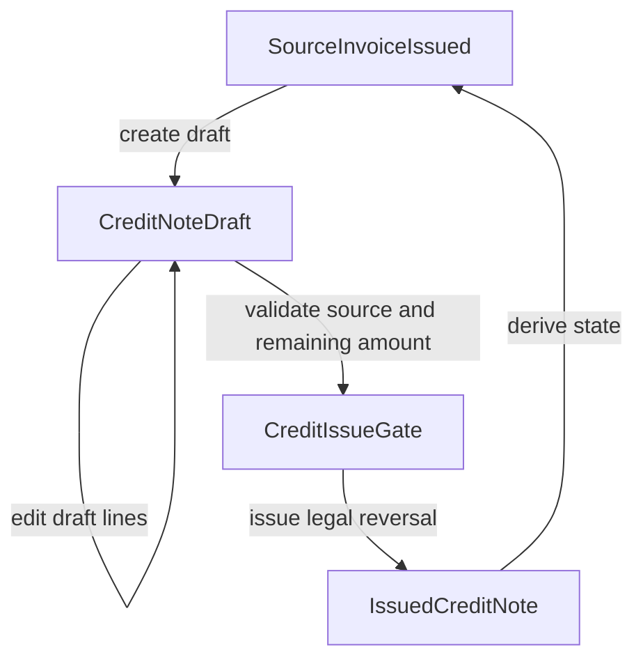

# Billing Credit/Reversal Foundation — Phase 2A Scope Review

This document defines the final safe execution scope for Credit/Reversal
Foundation Phase 2A.

It is a planning artifact only. It does not implement schema changes, migrations,
runtime behavior, UI behavior, refactors, accounting flows, or ERP concepts.

## Source Documents

This scope review depends on:

- `docs/billing-compliance-tax-authority-readiness-plan.md`
- `docs/billing-compliance-implementation-plan.md`
- `docs/billing-compliance-phase-1-immutable-issued-review.md`
- `docs/billing-credit-cancellation-architecture-plan.md`
- `docs/billing-credit-cancellation-implementation-review.md`

If this document conflicts with the compliance readiness plan, the compliance
readiness plan wins.

## Purpose

Phase 2A should create the smallest future implementation slice that gives
Billing a legal reversal foundation without turning Billing into accounting
software.

Allowed Phase 2A goal:

- legal reversal through credit-note documents
- legal correction without source invoice mutation
- immutable source invoice reference
- derived credited state
- archive continuity

Not allowed in Phase 2A:

- accounting engine
- ledger
- reconciliation
- bookkeeping system
- finance dashboard
- ERP workflow
- tax filing system
- broad approval workflow

## Current Baseline

Billing already has:

- immutable issued foundation
- `issuedSnapshot`
- `lockedAt`
- `legalSnapshotHash`
- numbering through `BillingDocumentNumberSequence`
- quote to invoice separation
- archive/document model
- credit/cancellation architecture planning
- credit/cancellation implementation review

Phase 2A must attach to these foundations without redesign.

## Exact Phase 2A Scope

Phase 2A should include only:

- `CREDIT_NOTE` as a new `BillingDocumentType`
- nullable `BillingDocument.referenceDocumentId`
- self-relation from credit note to source invoice
- focused index for linked document queries
- domain helpers for source invoice validation
- domain helpers for credited amount and remaining amount calculation
- credit draft creation service
- credit-note issuance through the existing legal issuance pattern
- derived credited read model for archive/detail APIs
- minimal current audit events, while keeping dedicated Billing audit as a
  remaining production blocker

Phase 2A should not include UI implementation. It can prepare data shape and
service behavior for future UI.

## Minimal Schema Additions

Exact future schema additions:

- add `CREDIT_NOTE` to `BillingDocumentType`
- add `referenceDocumentId Int?` to `BillingDocument`
- add optional `referencedDocument` self-relation
- add `creditNotes` inverse self-relation
- add `@@index([businessId, referenceDocumentId])`

Optional only after query review:

- `@@index([businessId, documentType, status])`

Do not add in Phase 2A:

- `reversalReason`
- `reversalType`
- `creditedAt`
- `creditedAmount`
- `remainingAmount`
- `creditStatus`
- `cancelledAt`
- `voidedAt`
- separate `CreditNote` table
- credit allocation table
- ledger models
- reconciliation models

### Why These Stay Out

`referenceDocumentId` is the only required structural legal relationship.

Full credit versus partial credit is derived from issued credit-note amount.

`creditedAt` is ambiguous because one invoice may have multiple credit notes.
The meaningful timestamps are the `issuedAt` values of linked credit notes.

`reversalReason` can later be captured in draft input and frozen into
`issuedSnapshot` if required. It is not needed for the Phase 2A structural
foundation.

Persisted credited totals or statuses would create drift risk and finance
complexity, so they stay out of Phase 2A.

## Credit Note Lifecycle

The source invoice remains:

- `documentType = TAX_INVOICE`
- `status = ISSUED`
- immutable forever

The credit note uses:

- `documentType = CREDIT_NOTE`
- `status = DRAFT`, `PENDING_REVIEW`, or `ISSUED`

Credit draft creation rules:

- source must belong to the same business
- source must be `TAX_INVOICE + ISSUED`
- source cannot be a quote
- source cannot be a credit note
- source invoice must not be mutated
- full credit may prefill lines up to remaining amount
- partial credit is represented as editable credit draft lines

Credit-note issuance rules:

- validate source invoice again inside the issuance transaction
- validate current remaining amount inside the issuance transaction
- reject over-credit in Phase 2A
- reject currency mismatch in Phase 2A
- allocate number from the `CREDIT_NOTE` document sequence
- build a credit-note `issuedSnapshot`
- include source invoice reference facts in the snapshot
- set `issuedAt`
- set `issuedByUserId`
- set `lockedAt`
- set `legalSnapshotHash`
- set number fields
- set PDF render status to pending
- do not mutate source invoice legal fields or totals

## Immutability Rules

Editable before credit-note issuance:

- credit note lines
- totals through line recomputation
- customer snapshot if product policy allows it
- future legal note/reason if introduced later
- `referenceDocumentId` while still draft

Immutable after credit-note issuance:

- `documentType`
- `documentNumber`
- `documentNumberFormatted`
- `issuedAt`
- `issuedByUserId`
- `issuedSnapshot`
- `lockedAt`
- `legalSnapshotHash`
- `referenceDocumentId`
- customer snapshot
- lines
- totals
- VAT values
- currency

Source invoice remains immutable before, during, and after credit-note creation.

## Derived Vs Persisted

Persist in Phase 2A:

- credit note document row
- credit note lines
- `referenceDocumentId`
- credit note `issuedSnapshot`
- credit note `lockedAt`
- credit note `legalSnapshotHash`
- credit note number fields
- PDF metadata

Derived only:

- credited amount
- reversed amount
- remaining amount
- partially credited
- fully credited
- credit note count
- archive relationship labels

Derived formulas:

- `creditedAmount = sum(totalAmount of CREDIT_NOTE + ISSUED where referenceDocumentId = invoice.id)`
- `remainingAmount = invoice.totalAmount - creditedAmount`
- `isPartiallyCredited = creditedAmount > 0 && creditedAmount < invoice.totalAmount`
- `isFullyCredited = creditedAmount >= invoice.totalAmount`
- `creditNoteCount = count(CREDIT_NOTE + ISSUED where referenceDocumentId = invoice.id)`

Draft credit notes must not affect any derived credited state.

## Runtime Safety Risks

Future implementation must touch these areas carefully:

- `lib/services/billing/billing-issue.service.ts`
  - allow `CREDIT_NOTE` issuance without weakening tax invoice issuance
  - validate credit-note source and remaining amount inside the transaction
- `lib/services/billing/billing-draft.service.ts`
  - preserve issued mutation blocking
  - support credit draft editing without source invoice mutation
- `lib/services/billing/billing-transition.service.ts`
  - keep review transitions status-safe
- `lib/services/billing/convert-quote-to-invoice.service.ts`
  - must not change quote conversion behavior
- `lib/services/billing/quote-document-number.ts`
  - must not become a renumbering backdoor
- PDF services
  - must remain operational-metadata-only
- archive/list APIs
  - must stay backward compatible with null `referenceDocumentId`

Mutation traps:

- draft line replacement deletes and recreates lines; it must remain blocked for
  any issued document
- source invoice must never be updated when credit note is created or issued
- derived credited values must not be written back to source invoice
- `referenceDocumentId` must not be mutable after credit-note issuance

## Archive Relationship Direction

After Phase 2A, archive/read model should be able to express:

- original invoice remains visible
- linked credit notes appear as separate legal documents
- invoice can show derived labels:
  - has credit note
  - partially credited
  - fully credited
- credit note can show source invoice reference
- detail view can show linked legal history

No UI implementation is part of Phase 2A. The data and service layer should make
the relationship available for future calm UI.

## Dangerous Edge Cases

Phase 2A must guard or define:

- double credit from concurrent issuance
- over-credit after another credit note is issued first
- self-reference
- credit note referencing quote
- credit note referencing credit note
- credit note referencing another business's invoice
- deleting linked source invoice or credit note
- mutating source invoice after credit note exists
- mutating credit note after issuance
- numbering conflict for `CREDIT_NOTE` sequence
- draft credit note shown as reducing invoice amount
- old issued invoices with null `lockedAt` or `legalSnapshotHash`

Concurrency requirement:

- final remaining amount and over-credit validation must happen inside the
  credit-note issuance transaction.

## What Not To Build Now

Keep outside Phase 2A:

- accounting engine
- ledger
- bookkeeping system
- reconciliation
- bank/payment matching
- tax filing
- SHAAM API integration
- finance dashboards
- ERP workflows
- complex approval systems
- cross-invoice credit allocation
- line-level credit allocation table
- `CANCELLED` status
- `VOIDED` status
- persisted credited status or cache
- standardized reason taxonomy
- payment behavior for credit notes

## Migration Safety

Future migration must be:

- additive only
- nullable-first
- backward compatible
- no destructive changes
- no data rewrite
- no required backfill
- no route contract change
- no PDF behavior change
- no quote conversion behavior change
- no numbering rewrite

Verification for future implementation:

- `prisma validate`
- `prisma generate`
- migration status/deploy check
- targeted lint or typecheck
- invoice issuance smoke test
- quote conversion smoke test
- archive/list smoke test
- credit-note issue smoke test after implementation exists

## Recommended Implementation Order

When implementation is approved, use this order:

1. Schema foundation:
   - `CREDIT_NOTE`
   - nullable `referenceDocumentId`
   - self-relation
   - focused index
2. Domain helpers:
   - validate source invoice
   - calculate issued credited amount
   - calculate remaining amount
   - reject over-credit
3. Credit draft service:
   - create full credit draft
   - allow partial credit through draft line editing
   - no source invoice mutation
4. Issuance extension:
   - allow `CREDIT_NOTE`
   - validate source and remaining amount inside transaction
   - allocate credit-note number
   - build credit-note snapshot with source reference facts
   - set lock/hash
5. Derived read model:
   - credit relationships
   - credited and remaining calculations
   - archive/detail API support
6. Audit slice:
   - credit draft created
   - credit note issued
   - credit note PDF rendered or failed
7. UI later:
   - calm create-credit-note flow
   - full/partial choice
   - linked legal history

## What Absolutely Must Exist In Phase 2A

To count as a minimal serious legal reversal foundation, Phase 2A must include:

- `CREDIT_NOTE`
- `referenceDocumentId`
- same-business issued-invoice reference guard
- credit-note issuance with legal snapshot/hash/lock
- source invoice immutability preserved
- over-credit rejection
- derived credited and remaining amount calculation
- archive-readable source and credit relationship

## What Can Safely Wait

Can wait after Phase 2A:

- dedicated legal audit model, although it remains a production readiness blocker
- cancellation semantics
- void semantics
- credit reason taxonomy
- persisted credited cache
- line-level allocations
- cross-invoice credits
- payment/reconciliation integration
- authority submission integration
- accountant reports
- UI polish beyond basic future flow

## Production Blockers Remaining After Phase 2A

Even after Phase 2A, Billing is still not fully compliance-production-ready until:

- dedicated `BillingAuditEvent` exists for legal events
- retention/export policy exists for invoices, credit notes, PDFs, snapshots, and
  audit
- authority/SHAAM readiness model exists
- payment awareness exists if product claims payment tracking
- `PENDING_REVIEW` semantics are decided consistently

Phase 2A removes the legal reversal blocker, but it does not complete the full
compliance program.

## Final Recommendation

Phase 2A should be narrowly scoped to legal reversal infrastructure:

- `CREDIT_NOTE`
- immutable source invoice reference
- credit-note issuance through the existing lock/hash/snapshot model
- derived credited state
- archive-readable relationship

Anything resembling cancellation statuses, accounting, reconciliation, ledgers,
tax filing, ERP workflows, or financial dashboards must remain outside Phase 2A.
