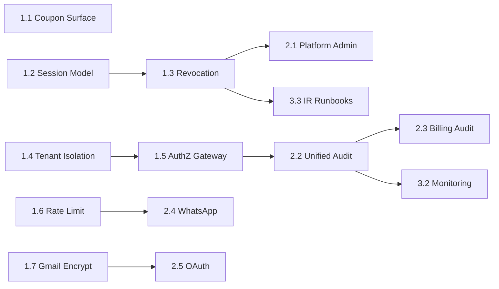

# Security Gap Matrix — מקור אמת (Planning Only)

> **סטטוס:** v1.1 · תאריך: 2026-06-03  
> **תחולה:** SaaS multi-tenant — מסמכים, לקוחות, WhatsApp, Billing, Inventory, Platform Admin, ובעתיד מנויים וסליקה.  
> **היקף מסמך:** תכנון בלבד. אין קוד, אין implementation, אין PR, אין schema/runtime changes.  
> **מסמכי בסיס:** Security Audit Mapping (שיחת סוכן), `docs/security-architecture-review.md`, Threat Modeling (§1 באותו מסמך), `docs/billing-compliance-*`.
>
> **פערים רגולטוריים (ITA):** ההתחייבויות החתומות מול רשות המסים והפערים הנגזרים מהן (כולל H-13/H-14/M-16) מיוצגים ומרוכזים ב-`docs/security-master-plan-v1.md` **§13 (Regulatory Commitments — ITA)** — מקור-האמת היחיד למיפוי-הרגולטורי. מטריצה זו אינה משכפלת אותם.

> ---
> **⚠️ עדכון Ground Truth — 2026-07-31 (בסיס: `origin/main` @ `cd4048c`):**
> מסמך זה נכתב כ-Planning ב-2026-06-03 ולא נסע עם הקוד. מאז חלק מהפריטים מומשו ישירות ב-mainline. סטטוס אמת עדכני מהקוד:
> - **W1-01 / D4 (Coupon Surface):** ✅ **Verified / Closed** (2026-07-31, PR #157, merge `6e9935a`, production deploy success, Closure Verification 5/5) — `/api/revenue/coupons/[id]/code` דורש auth + issuer-ownership (401/403/200); ה-DTOs הציבוריים ללא `token`/`qrValue`/`redeemLink` וללא `coupon.id` פנימי. "Public coupon secret exposure" = **Fully Resolved**.
> - **1.6 / D3 (Distributed Rate Limiting):** ✅ **Implemented** ב-mainline (`lib/security/rate-limiter/redis-backend.ts`, Upstash).
> - **1.7 / D5 (Gmail Token Encryption):** ✅ **Implemented** (AES-256-GCM at-rest) — אך אימות **AAD = businessId עדיין פתוח**.
> - **1.2/D1 (Session), 1.3 (Token Revocation), 1.4/D2 (Business Isolation מבני), 1.5 (Authorization Gateway):** 🔴 **טרם מומשו** — נשארים כפי שמתוארים למטה.
>
> תאי הסטטוס ב-§0 עודכנו בהתאם. שאר גוף התכנון (החלטות/ארכיטקטורה) לא שונה.

---

## 0. סטטוס החלטות ארכיטקטוניות (Architecture Decisions)

| ID | החלטה | סטטוס | מסמך |
|----|--------|--------|------|
| **D1** | O2 — Server Session (Postgres) + httpOnly cookie; תנאים C1–C6 | **Approved** (Implementation לא התחיל) | `docs/security-d1-session-architecture-review.md` |
| **D2** | **Goal:** structural DB-backed tenant isolation (RLS). **Runtime arch (Spike-B validated):** dedicated **non-`BYPASSRLS`** runtime role + separate migration/owner role + `@prisma/adapter-neon` (Neon serverless driver) + ALS tenant context + `SET LOCAL` in transaction + `FORCE` RLS, fail-closed | **Goal `LOCKED` · Runtime Arch `VALIDATED` (Spike B) · Impl `NOT STARTED`** | `docs/security-d2-tenant-isolation-architecture-v1.md` (canonical; supersedes the earlier impact-review / decision-package refs, which are **not** in-repo) |
| **D3** | Upstash Redis (rate limiting) | ✅ **Implemented** (mainline — `lib/security/rate-limiter/redis-backend.ts`) | `docs/security-wave-1-design-review-d1-d2-d3.md` |
| **D4** | Coupon: QR/token לא ציבורי; marketing מותר; redeem מורשה | ✅ **Verified / Closed** — W1-01 (PR #157, merge `6e9935a`, 2026-07-31) | `docs/security-w1-01-coupon-surface-implementation-plan.md` |
| **D5** | Gmail token encryption AAD = `businessId`; יישור מודל עם WhatsApp | ✅ **Implemented** (GCM at-rest); ⚠️ אימות AAD=businessId פתוח | Wave 1 — 1.7 |

**D2 Locked — עקרונות מחייבים ל-Implementation (מתוך H1–H5):**

- **H1:** `ContentFeedback` tenant-scoped (`businessId`); אין דליפת learning cross-tenant.
- **H2:** הסרה/השבתת `POST /api/business`; אין multi-business ב-Wave 1; אין orphan businesses.
- **H3:** Runtime = pooled `DATABASE_URL`; migrations/DDL = `DIRECT_URL`; RLS = `SET LOCAL` בתוך transaction; staging gate לפני production.
- **H4:** `TenantMode.OAUTH`; `OAuthToken` רק דרך `EmailConnection`; cookies OAuth נפרדים מ-session D1; H4-E (callback bind-session) → Wave 2.
- **H5:** FORCE RLS על 8 טבלאות Phase 1; fail-closed ללא tenant setting; Platform Admin = `setTenantContext(targetBusinessId)` בלבד (לא bypass גלובלי); Phase 2 RLS נדחה.

---

## 1. מטריצת פערים (Gap Matrix)

| Domain | Current State | Target State | Risk (if untreated) | Severity | Effort | Priority | Dependencies |
|--------|---------------|--------------|---------------------|----------|--------|----------|--------------|
| **Authentication** | Bearer HMAC-SHA256 (`lib/auth-token.ts`), TTL ~30 יום, stateless; login/register עם bcrypt; אין Next-Auth; אין MFA; brute-force רק IP + in-memory | זהות מאומתת עם access קצר-מועד, מדיניות סיסמאות מפורשת, MFA לזהויות רגישות, הגנת brute-force per-account, deny-by-default על routes ללא הצהרת auth | גניבת/זיוף session ארוכת טווח; חשבונות נפרצים ללא הגנה מספקת; אין תגובה מהירה לפריצה | **Critical** | **Large** | **P1** | Session Management, Token Revocation, Rate Limiting, API Security |
| **Session Management** | אין session בצד שרת; token ב-`localStorage`; `sessionId` ל-analytics בלבד; logout = מחיקת client בלבד | סשן מנוהל שרת (או זוג access/refresh עם רישום מצב); אחסון credential ב-httpOnly/Secure cookies; רישום מכשיר/סשן; ביטול סשן מרחוק | XSS → גניבת token מלאה; אין visibility לסשנים פעילים; logout לא מבטל גישה | **Critical** | **Large** | **P1** | Authentication, Token Revocation, API Security |
| **Token Revocation** | אין revocation list; אין logout server-side; שינוי סיסמה לא מבטל tokens קיימים; legacy numeric tokens נדחים (טוב) | יכולת ביטול מיידי (logout, compromise, password change, admin action); רישום issued tokens/sessions; invalidation לפני TTL | token גנוב תקף עד 30 יום; אין תגובה לאירוע T6 | **Critical** | **Medium** | **P1** | Session Management, Authentication, Incident Response |
| **Authorization** | `getCurrentUser` ידני per-route; אין middleware גלובלי; deny-by-default לא אוכף; roles: USER / PLATFORM_ADMIN בלבד; capabilities קיימים אך לא שער מרכזי | שכבת אכיפה מרכזית (gateway/middleware); deny-by-default; object-level ownership אחיד; permissions/capabilities מחייבים לפי route | route חדש/שכוח ללא בדיקה → גישה לא מורשית; IDOR בנקודה בודדת | **High** | **Large** | **P1** | API Security, Business Isolation, Audit Logging |
| **Business Isolation** | סינון `user.businessId` ידני; אין RLS/Extension; `POST /api/business` orphan; `ContentFeedback` ללא tenant; `/api/learning` cross-tenant | **D2 Locked:** Extension+ALS; RLS Phase 1 (8 tables, FORCE, `SET LOCAL`); H1 tenant `ContentFeedback`; H2 הסרת `POST /api/business`; H3 dual URL; H4/H5 כמתועד | דליפת נתונים בין עסקים (T3) | **Critical** | **Large** | **P1** | Authorization, API Security (1.5), D3 (1.6) |
| **Platform Admin** | role + `PLATFORM_ADMIN_EMAILS` (fail-closed prod); UI gate client-only; cross-tenant read; write: feature PATCH בלבד (+ flag); WhatsApp seed בלי allowlist audit; dev: allowlist ריק = פתוח | MFA חובה; server-side guard על `/admin`; audit לכל פעולה; RBAC פנימי (read/write/billing); break-glass נפרד; impersonation מתועד אם קיים | ניצול admin ללא עקבה; cross-tenant abuse; privilege escalation ב-non-prod | **High** | **Medium** | **P2** | Authentication, Audit Logging, Authorization, Incident Response |
| **Audit Logging** | 3 מערכות: `PlatformAuditEvent`, `BillingAuditEvent`, `LearningEvent`; best-effort; billing draft/submit/revert רק ב-LearningEvent; אין API ל-billing audit timeline; auth failures חלקיים | security audit trail אחיד, append-only, לא ניתן לשינוי; כיסוי auth/authz/admin/billing/export; הפרדה מ-product-usage; retention וחקירה | אי-עמידה ב-compliance; אין forensic אחרי פרצה; פעולות רגישות ללא עקבה | **High** | **Large** | **P2** | Billing Security, Platform Admin, Monitoring, Incident Response |
| **Documents Security** | private storage `biz/{businessId}/documents/`; proxy auth `GET .../file`; tenant check; MIME/size limits; rate limit upload; ללא presigned ל-production | כל גישה: auth + tenant + allowlist; ללא active content inline; אופציונלי signed TTL; סריקת תוכן; מדיניות retention | גישה לקבצים פיננסיים ללא הרשאה; malware/XSS דרך קבצים | **Medium** | **Medium** | **P2** | Storage Security, File Uploads, Business Isolation |
| **Storage Security** | R2/local; documents private; content/inventory/offers public CDN כשמוגדר; signed URL API קיים — לא בשימוש ל-documents; local חסום ב-prod | הפרדת buckets/prefix; מדיניות visibility מרכזית; מפתחות מאומתים; rotation credentials; אין public ל-domains רגישים | דליפה דרך URL ציבורי שגוי; traversal; credential leak | **Medium** | **Medium** | **P2** | Documents Security, Secrets Management, Business Isolation |
| **WhatsApp Integration** | HMAC webhook + verify token; tokens AES-256-GCM+AAD=businessId; embedded signup מתעלם מ-body businessId; media fetch עדיין `WHATSAPP_ACCESS_TOKEN` env; `getAccessTokenForBusiness` לא בשימוש | per-tenant token לכל Graph call; replay protection webhook; rate limit webhook; audit לחיבור/ניתוק; scope מינימלי | פעולה בשם עסק שגוי; token גלובלי חוצה tenants; webhook replay/DoS | **High** | **Medium** | **P2** | Secrets Management, OAuth Flows, Audit Logging, Rate Limiting |
| **Gmail Integration** | OAuth PKCE + cookies; tokens ב-DB — הצפנה placeholder/חלשה לעומת WhatsApp; sync/import מאומתים ל-business | הצפנה מלאה כמו WhatsApp; refresh rotation; scope מינימלי; ניתוק מבטל אצל Google; SSRF policy על fetch | insider/DB leak קורא tokens; גישה לדואר ללא בידוד | **High** | **Medium** | **P1** | OAuth Flows, Secrets Management, Business Isolation |
| **OAuth Flows** | Gmail: connect (Bearer) → cookies → callback ללא Bearer; state/PKCE; WhatsApp: embedded signup session-bound; אין מטריצת redirect URI מרכזית מתועדת | כל flow: state מחייב, PKCE, redirect allowlist, קישור tenant לאימות מחדש, timeout cookies, audit connect/disconnect | OAuth hijacking; קישור token לעסק שגוי; CSRF על callback | **High** | **Medium** | **P2** | Gmail Integration, WhatsApp Integration, Session Management |
| **Secrets Management** | env vars; fail-fast על מפתחות קריטיים; WhatsApp/Gmail keys ב-env; אין vault/KMS; אין rotation מתוזמן | vault/KMS; הפרדת סביבות; rotation + re-encryption plan; מדיניות אי-לוג; סריקת repo/CI | דליפת production secrets; אי-יכולת rotate אחרי incident | **High** | **Large** | **P3** | WhatsApp Integration, Gmail Integration, Authentication, Incident Response |
| **Billing Security** | immutability issued; numbering per business; PDF tenant-scoped; compliance docs קפואים; list API חושף `pdfStorageKey`/`pdfHash`; audit מפוצל; credit note draft ללא API | עמידה מלאה ב-`docs/billing-compliance-*`; audit ייעודי לכל lifecycle; מינימום exposure ב-API; הפרדת הרשאות פיננסיות; מוכנות סליקה/PCI נפרד | tampering מספור/מסמך; חוסר עקבות רשותית; חשיפת metadata פנימי | **High** | **Medium** | **P2** | Audit Logging, Authorization, Business Isolation |
| **Coupon Surface** | `GET /api/revenue/coupons/active` — cross-tenant; `GET .../[id]/code` — **ללא auth** מחזיר token/QR; redeem דורש Bearer | surface ציבורי מוגדר ומצומצם (מטא-דאטה בלבד); קוד מימוש רק לאחר אימות/הרשאה מפורשת; rate limit + anti-enumeration | גניבת קופונים המונית; הונאת מימוש; דליפת מידע עסקי | **Critical** | **Small** | **P1** | API Security, Rate Limiting, Authorization |
| **File Uploads** | documents/content/inventory: MIME, size, rate limits חלקיים; content → public asset אפשרי; אין סריקת malware מרכזית | מדיניות upload אחידה; deny active types; virus scan; quota per tenant; validation שם קובץ מחמיר | malware storage; DoS; stored XSS | **Medium** | **Medium** | **P2** | Documents Security, Storage Security, Rate Limiting |
| **API Security** | ~125 routes; אין `middleware.ts`; public/webhook/POS/coupons; validation בשכבת שירות; אין Zod סטנדרטי ב-routes | מלאי routes מסווג; שער auth מרכזי; סכמת validation אחידה; מדיניות versioning/deprecation; security headers | endpoint לא מוגן; injection; information disclosure | **High** | **Large** | **P1** | Authorization, Rate Limiting, Business Isolation |
| **Rate Limiting** | in-memory בלבד (`lib/security/rate-limit.ts`); login/register/uploads/POS בלבד; לא עובד multi-instance | shared store (Redis/Upstash); הגבלות per-IP, per-account, per-tenant, per-endpoint רגיש; ניטור חריגות | brute-force; scraping; webhook/DoS; abuse קופונים | **High** | **Medium** | **P1** | Authentication, Coupon Surface, API Security, Monitoring |
| **Monitoring** | product-usage events; health dev חושף שמות env; אין alerting אנומליה; אין SIEM | התראות: login חריג, 403 spikes, export מסיבי, webhook flood; dashboards security; correlation עם audit | פריצה לא מזוהה; זמן תגובה ארוך | **Medium** | **Medium** | **P3** | Audit Logging, Rate Limiting, Incident Response |
| **Incident Response** | אין runbooks מחייבים; אין break-glass; revocation לא קיים; GDPR 72h לא ממומש | runbooks: token leak, B2B leak, admin compromise; break-glass + התראה; תרגילים; דיווח 72h; backup/restore מאומת | כאוס בתגובה; הרחבת נזק; אי-עמידה רגולטורית | **Medium** | **Medium** | **P3** | Token Revocation, Platform Admin, Audit Logging, Secrets Management |

---

## 2. מקרא

### Severity
| רמה | משמעות |
|-----|---------|
| **Critical** | compromise רוחבי / נתונים פיננסיים / tokens — דורש סגירה לפני scale |
| **High** | דליפה או privilege משמעותי — חובה ב-Phase 1–2 |
| **Medium** | hardening / compliance readiness |
| **Low** | שיפור, לא חוסם (לא בשורות לעיל — הכל Medium ומעלה) |

### Effort
| רמה | משמעות |
|-----|---------|
| **Small** | שינוי ממוקד, מעט מערכות |
| **Medium** | מספר routes/services, ללא שינוי ארכיטקטוני מלא |
| **Large** | שינוי חוצה-מערכת (session, RLS, gateway) |

### Priority
| עדיפות | קריטריון |
|--------|-----------|
| **P1** | חוסם onboarding / scale — Critical או High עם blast radius מיידי |
| **P2** | High — לפני production רחב או לקוחות רגישים |
| **P3** | Hardening + enterprise readiness |
| **P4** | עתידי (SSO, pen-test, attestations) — מחוץ ל-backlog המיידי |

---

## 3. Security Hardening Backlog (סדר ביצוע מומלץ)

סדר זה משקף **תלויות + סיכון (Threat Model §1.3)**. כל פריט הוא יעד תכנוני — לא מפרט implementation.

### Wave 1 — P1 Critical Path (חוסם scale)

| # | Backlog Item | Domains | Severity | Effort | תלות |
|---|--------------|---------|----------|--------|------|
| 1.1 | צמצום/הקשחת Coupon Public Surface (קוד מימוש ללא auth) | Coupon Surface | Critical | Small | — |
| 1.2 | מודל Session + אחסון credential לא ב-localStorage | Session Management, Authentication | Critical | Large | — |
| 1.3 | Token Revocation + TTL קצר + ביטול ב-password change/logout | Token Revocation | Critical | Medium | 1.2 |
| 1.4 | Business Isolation מבני (RLS או data-access בלתי-עקיף) | Business Isolation | Critical | Large | — |
| 1.5 | Authorization Gateway + deny-by-default + מלאי routes | Authorization, API Security | High | Large | 1.4 |
| 1.6 | Rate Limiting ב-shared store + account lockout login | Rate Limiting, Authentication | High | Medium | — |
| 1.7 | Gmail OAuth tokens — הצפנה at-rest כמו WhatsApp | Gmail Integration, Secrets Management | High | Medium | — |

### Wave 2 — P2 High (לפני production רחב)

| # | Backlog Item | Domains | Severity | Effort | תלות |
|---|--------------|---------|----------|--------|------|
| 2.1 | Platform Admin: server guard + MFA + audit מלא לפעולות write/cross-tenant | Platform Admin | High | Medium | 1.2, 1.3 |
| 2.2 | Security Audit Trail אחיד (auth, authz fail, admin, billing lifecycle, export) | Audit Logging | High | Large | 1.5 |
| 2.3 | Billing: צמצום API exposure + יישור audit ל-compliance spec | Billing Security | High | Medium | 2.2 |
| 2.4 | WhatsApp: per-tenant token ל-media/Graph; webhook replay + rate limit | WhatsApp Integration | High | Medium | 1.6 |
| 2.5 | OAuth flows: מדיניות מרכזית + audit connect/disconnect | OAuth Flows | High | Medium | 1.7, 2.4 |
| 2.6 | Documents + File Uploads: active-type ban, scan, מדיניות אחידה | Documents Security, File Uploads | Medium | Medium | 1.4 |
| 2.7 | Storage: סקירת public domains + מדיניות visibility | Storage Security | Medium | Medium | 2.6 |

### Wave 3 — P3 Hardening

| # | Backlog Item | Domains | Severity | Effort | תלות |
|---|--------------|---------|----------|--------|------|
| 3.1 | Secrets: vault/KMS + rotation policy | Secrets Management | High | Large | — |
| 3.2 | Monitoring & alerting (אנומליות + SIEM-ready) | Monitoring | Medium | Medium | 2.2, 1.6 |
| 3.3 | Incident Response runbooks + break-glass + תרגיל revocation | Incident Response | Medium | Medium | 1.3, 2.1 |
| 3.4 | MFA למשתמשים; חובה ל-Platform Admin | Authentication | High | Medium | 1.2 |
| 3.5 | GDPR mechanics (export/erasure, RoPA, 72h procedure) | Incident Response, Audit Logging | Medium | Large | 2.2 |

### Wave 4 — P4 Future (תכנון מראש)

| # | Backlog Item | Domains | הערה |
|---|--------------|---------|------|
| 4.1 | Billing/סליקה — PCI scope separation | Billing Security | לפני כניסת סליקה |
| 4.2 | SSO / SCIM | Authentication | enterprise |
| 4.3 | Pen-test + bug bounty + SOC2/ISO | API Security | Wave 4 |

---

## 4. מפת תלויות (תמצית)

---

## 5. קישור ל-Roadmap קיים

מטריצה זו מממשת את **Phase 1–4** מ-`docs/security-architecture-review.md` §5 ברזולוציית domain:

| Roadmap Phase | פריטי Backlog |
|---------------|----------------|
| Phase 1 Critical | 1.1–1.7 |
| Phase 2 High | 2.1–2.7 |
| Phase 3 Hardening | 3.1–3.5 |
| Phase 4 Enterprise | 4.1–4.3 |

---

## 6. בעלות ועדכון מסמך

| פעולה | בעלות מוצעת |
|-------|-------------|
| עדכון שורה ב-Gap Matrix אחרי שינוי ארכיטקטוני | Security lead + מפתח domain |
| שינוי Priority | Product + Security (מבוסס threat model) |
| סגירת פריט Backlog | דורש אימות מצב נוכחי (re-audit mapping) — לא סגירה על בסיס implementation בלבד |

**גרסה:** v1.1 — עודכן לאחר נעילת D2 (H1–H5). יש לעדכן Current State אחרי Re-Mapping post-implementation.

---

## 7. Wave 1 — מוכנות Implementation (תכנון)

| Phase | פריטים | חסום ע"י | מוכן להתחלה? |
|-------|--------|----------|--------------|
| **A** | 1.1 Coupon, 1.6 Upstash, 1.7 Gmail | D2 **לא** חוסם Phase A | **כן** — לאחר אישור תכנון Implementation (לא קוד עדיין) |
| **B** | 1.4 Business Isolation | **D2 Locked** — מימוש לפי H1–H5 | אחרי Phase A (מומלץ) |
| **C** | 1.2 Session, 1.3 Revocation (D1) | D1 Approved | אחרי Phase B (מומלץ) |
| **D** | 1.5 AuthZ Gateway | 1.4 | אחרי Phase B+C |

---

*סוף מסמך — תכנון בלבד.*
