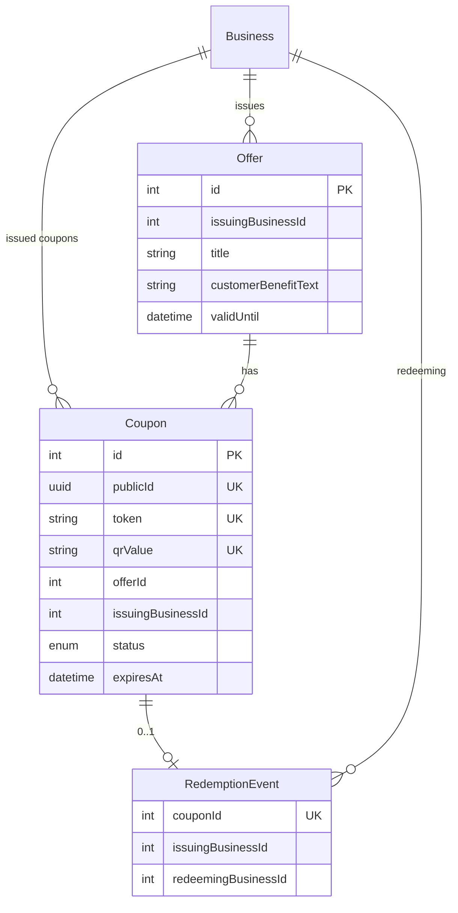
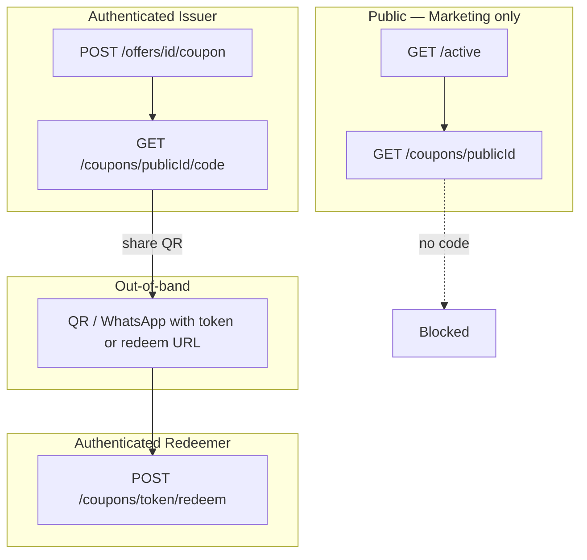

# W1-01 — Coupon Public Surface Implementation Plan

> **סטטוס:** Draft v1 · תאריך: 2026-06-03  
> **היקף:** תכנון Implementation בלבד — **אין** קוד, PR, migration, schema, או runtime.  
> **מקורות:** Gap Matrix 1.1, `docs/security-wave-1-execution-plan.md` (W1-01), **D4 Approved**, `docs/security-policy.md` §2.2 / §4 / Gate 2.  
> **תלות מומלצת:** W1-02 (1.6 Distributed Rate Limit) — במקביל או מיד לפני/אחרי; לא חוסם תכנון.

> ---
> **✅ סטטוס Implementation — 2026-07-31: IMPLEMENTED** (ענף `feat/security-w1-01-coupon-surface`, בסיס `origin/main` @ `cd4048c`).
> מימוש בפועל מול תכנית D4:
> - `GET /api/revenue/coupons/[id]/code` — נעול: `getCurrentUser` → `requireIssuerBusinessId` (401 ללא auth) → `getCouponCode(publicId, businessId)` עם בדיקת `issuingBusinessId === requestingBusinessId` (403 ללא בעלות) → 200 רק למנפיק. קבצים: `app/api/revenue/coupons/[id]/code/route.ts`, `lib/services/revenue/coupon-code.service.ts`.
> - הסרת `coupon.id` הפנימי מ-DTO ציבורי; שימוש ב-`publicId` בלבד. `lib/services/revenue/coupon-details-public.service.ts`, `active-coupons.service.ts`.
> - Routes ציבוריים (`active`, `[id]`) נשארו marketing-only — ללא `token`/`qrValue`/`redeemLink`.
> - מסך הפרטים שולח Bearer ל-`/code`, מציג CTA התחברות ב-401 וטיפול ברור ב-403 (עברית). `app/revenue/coupons/[id]/page.tsx`.
> - **ללא emergency bypass** — auth בלתי-מותנה בכל הסביבות (fail-closed by absence); לא קיים env-flag שפותח את `/code` ללא auth בפרודקשן.
> - בדיקות: `lib/services/revenue/coupon-code.access.verify.test.ts` (20 checks, כולל anonymous→401, wrong-issuer→403, issuer→200, DTO ללא סודות/ללא internal id, ו-no-prod-bypass).
> - **מחוץ ל-scope (כמתוכנן):** cross-tenant marketing ב-`active` נשאר לטיפול עתידי תחת Business Isolation (1.4); redeem-flow ללא שינוי; ללא שינוי schema.

---

## 0. החלטת D4 (מאושרת — מחייבת לתכנון)

| עיקרון | משמעות ל-W1-01 |
|--------|----------------|
| QR וקודי מימוש **אינם** ציבוריים | אין חשיפת `token`, `qrValue`, `redeemLink` ללא אימות |
| אין endpoint ציבורי שמחזיר redemption data | `/code` חייב auth + הרשאה; `redeem` נשאר מאומת |
| מידע שיווקי **רשאי** להישאר ציבורי | `active`, `GET [id]` — מטא-דאטה בלבד (ללא קוד מימוש) |
| מימוש דורש גישה מורשית | `POST /api/coupons/[token]/redeem` — Bearer + `user.businessId` (קיים) |

**מחוץ ל-W1-01 (מאושר בנפרד):** D5 (Gmail AAD), D2 tenant isolation על `Coupon`/`Offer` (Phase B).

---

## 1. ארכיטקטורת קופונים — מצב נוכחי

### 1.1 מודל נתונים (Prisma)

| שדה | שימוש | רגישות (D4) |
|-----|--------|-------------|
| `publicId` | כרטיס שיווקי, URL `/revenue/coupons/{publicId}` | נמוך — מזהה פרסומי |
| `token` | מימוש (`POST .../redeem`), QR deep link `?token=` | **גבוה — סוד מימוש** |
| `qrValue` | URL מלא ל-`/revenue/redeem?token=...` | **גבוה** |
| `status`, `expiresAt`, `redeemedAt` | תצוגת מצב | בינוני — מותר במטא-דאטה ציבורי |

### 1.2 זרימות עסקיות (User Journeys)

| # | זרימה | נתיב UI | API עיקרי | Auth היום |
|---|--------|---------|-----------|-----------|
| **F1** | גילוי קופונים (שוק) | `/revenue` → `/revenue/coupons/[publicId]` | `GET active`, `GET [id]`, `GET [id]/code` | **ללא** על 3 ה-GET |
| **F2** | הנפקת קופון (issuer staff) | `/offers`, `/revenue/issue`, `/promotions/coupons` | `POST /api/offers/[id]/coupon` | Bearer |
| **F3** | הצגת QR אחרי הנפקה | `CouponDisplay` / `FullScreenQrModal` | תגובת POST create (מכילה `token`, `qrValue`) | Bearer |
| **F4** | חשיפת קוד מדף פרטים | כפתור "הצג קוד קופון" | `GET [id]/code` | **ללא** |
| **F5** | מימוש (redeemer) | `/revenue/redeem` | `POST /api/coupons/[token]/redeem` | Bearer |
| **F6** | מימוש אוטומטי מ-QR | `?token=` ב-URL → `RedeemScreen` | כמו F5 | Bearer (חובה ל-POST) |

### 1.3 יצירת קופון (`coupon.service.ts`)

- `token` = `randomUUID()`.
- `qrValue` = `{APP_BASE_URL}/revenue/redeem?token={token}`.
- אין `publicId` ב-create — נוצר ב-DB (`@default(uuid())`).
- Audit: `REVENUE_COUPON_CREATED` (כולל `token` ב-payload — לוג פנימי).

### 1.4 מימוש (`redeem.service.ts`)

- חיפוש לפי `token` (לא `publicId`).
- אין בדיקה ש-`redeemingBusinessId` קשור ל-offer (B2B cross-redeem מותר כיום).
- Idempotent-ish: `updateMany` + `RedemptionEvent` unique על `couponId`.
- Audit: `REVENUE_COUPON_REDEEMED` / `REVENUE_COUPON_REDEEM_REJECTED`.

### 1.5 גילוי ציבורי (`active-coupons.service.ts`)

- `findMany` על **כל** קופונים `ACTIVE` + `expiresAt > now` (ללא `businessId`).
- דירוג: `rankActiveCoupons` → עד 6 כרטיסים.
- **דליפה cross-tenant:** עסק A רואה קופונים של עסק B (מטא-דאטה) — **לא** נסגר ב-D4; מומלץ כ-hardening נלווה או Phase B (1.4).

---

## 2. Routes מושפעים

### 2.1 טבלת API מלאה

| Method | Route | Auth היום | מחזיר redemption? | שינוי מתוכנן (D4) |
|--------|-------|-----------|-------------------|-------------------|
| `GET` | `/api/revenue/coupons/active` | **אין** | לא (`publicId` בלבד) | **נשאר ציבורי** (מטא-דאטה); rate limit (W1-02); אופציונלי: tenant scope בעתיד |
| `GET` | `/api/revenue/coupons/[id]` | **אין** | לא | **נשאר ציבורי**; וידוא DTO ללא `token`/`qrValue`; שקול הסרת `coupon.id` מה-response הציבורי |
| `GET` | `/api/revenue/coupons/[id]/code` | **אין** | **כן** (`token`, `qrValue`, `redeemLink`) | **חובה auth** + ownership; 401/403 ללא הרשאה; **אין** fallback ציבורי |
| `POST` | `/api/coupons/[token]/redeem` | Bearer | תוצאת מימוש | **ללא שינוי חוזה** (כבר מורשה); וידוא שלא דולף `token` מיותר ב-response |
| `POST` | `/api/offers/[id]/coupon` | Bearer | **כן** (אובייקט coupon מלא) | **נשאר** — issuer authenticated; תיעוד שזה ה-channel היחיד ל-"issue + QR" |
| `GET` | `/api/offers` | Bearer | לא | ללא שינוי (רשימת offers ל-promotions) |
| `GET` | `/api/offers/[id]` | Bearer | לא (אולי coupons nested) | בדיקה: `include.coupons` — **אסור** לחשוף `token` ב-GET offer אם קיים |

### 2.2 Routes שלא משתנים ב-W1-01

- `POST /api/offers` — יצירת offer.
- `POST /api/offers/image` — תמונת offer.
- אין route ציבורי נוסף ל-coupon ב-grep (מאומת 2026-06-03).

### 2.3 סיווג TenantMode (יישור D2 / Gateway עתידי)

| Route | מצב נוכחי | מצב יעד |
|-------|-----------|---------|
| `GET /api/revenue/coupons/active` | PUBLIC | PUBLIC (marketing) |
| `GET /api/revenue/coupons/[id]` | PUBLIC | PUBLIC (marketing) |
| `GET /api/revenue/coupons/[id]/code` | PUBLIC (**פגיע**) | **USER** + issuer ownership |
| `POST /api/coupons/[token]/redeem` | USER (Bearer) | USER |
| `POST /api/offers/[id]/coupon` | USER | USER |

---

## 3. מסכי UI מושפעים

| מסך | נתיב | קריאות API | השפעת D4 |
|-----|------|------------|----------|
| Revenue — רשימת קופונים | `app/revenue/page.tsx` | `GET /api/revenue/coupons/active` | נמוכה — נשאר ללא login |
| Revenue — פרטי קופון + QR | `app/revenue/coupons/[id]/page.tsx` | `GET [id]`, `GET [id]/code` | **גבוהה** — `/code` עם Bearer; gate login לפני "הצג קוד"; הודעת שגיאה 401 |
| Revenue — הנפקה | `app/revenue/issue/page.tsx` → `IssueScreen` | `POST /api/offers/[id]/coupon` | נמוכה — QR מ-response (מורשה) |
| Revenue — מימוש | `app/revenue/redeem/page.tsx` → `RedeemScreen` | `POST /api/coupons/[token]/redeem` | נמוכה — כבר דורש token ב-localStorage |
| Promotions — קופונים | `app/promotions/coupons/page.tsx` | `GET /api/offers` (דרך `fetchCoupons`) | ללא שינוי API coupon |
| Offers (legacy) | `app/offers/page.tsx` | `POST .../coupon` | מציג token אחרי create — **מורשה** (logged-in issuer) |
| Offers create | `app/offers/create/page.tsx` | offers API | ללא קשר ישיר ל-`/code` |

### 3.1 Components

| קומפוננטה | קובץ | הערה |
|-----------|------|------|
| `CouponDisplay` | `components/revenue/issue/coupon-display.tsx` | מציג QR מ-`coupon.qrValue` אחרי issue — **לא** קורא `/code` |
| `FullScreenQrModal` | `components/revenue/issue/full-screen-qr-modal.tsx` | אותו מקור נתונים |
| `RedeemScanner` | `components/revenue/redeem/redeem-scanner.tsx` | סורק `token` מ-URL/מצלמה — לא תלוי ב-API ציבורי |
| `RedeemScreen` | `components/revenue/redeem/redeem-screen.tsx` | `?token=` deep link — מימוש דורש login |

### 3.2 Helpers

| קובץ | שימוש |
|------|--------|
| `lib/revenue/issue/issue.helpers.ts` | `fetchOffers`, `createCoupon`, `fetchCoupons` |
| `lib/revenue/issue/issue.types.ts` | `IssuedCoupon` כולל `token`, `qrValue` |
| `lib/revenue/issue/coupon-guidance.ts` | תוכן הנחיה — ללא API |

---

## 4. Services מושפעים

| Service | קובץ | פעולה מתוכננת |
|---------|------|----------------|
| `getActiveCoupons` | `lib/services/revenue/active-coupons.service.ts` | ללא שינוי D4 חובה; אופציונלי: הסרת/הגבלת `issuingBusiness.id` בפרסום |
| `getPublicCouponDetails` | `lib/services/revenue/coupon-details-public.service.ts` | וידוא DTO; rename ל-`getMarketingCouponDetails` (אופציונלי) |
| `getCouponCode` | `lib/services/revenue/coupon-code.service.ts` | **הוספת** `assertCouponCodeAccess(user, publicId)` — רק `issuingBusinessId === user.businessId` או מדיניות מורחבת מתועדת |
| `createCouponFromOffer` | `lib/services/coupon.service.ts` | ללא שינוי |
| `redeemCoupon` | `lib/services/redeem.service.ts` | ללא שינוי חוזה; בדיקת response שלא מחזיר שדות מיותרים |
| `rankActiveCoupons` | `lib/services/revenue/active-coupons.rank.ts` | ללא שינוי |

### 4.1 Auth helper (חדש בתכנון)

- פונקציה מרכזית: `requireAuthenticatedUser(req)` + `canRevealCouponCode(user, coupon)`.
- כלל D4 מינימלי: **רק משתמש מחובר של `issuingBusinessId` של הקופון** רואה `/code`.
- **לא** מאשר: redeemer לראות QR דרך `/code` (מקבל token רק מ-QR פיזי / הודעה מהמנפיק).

---

## 5. Endpoints ציבוריים — לפני ואחרי

| Endpoint | לפני | אחרי (D4) |
|----------|------|-----------|
| `GET .../active` | 200 + רשימת מטא-דאטה cross-tenant | 200 + אותו מטא-דאטה (מותר); + rate limit |
| `GET .../[id]` | 200 + פרטי שיווק + `coupon.id` | 200 + מטא-דאטה בלבד; ללא שדות מימוש |
| `GET .../[id]/code` | 200 + `{ token, qrValue, redeemLink }` | **401** ללא Bearer; **403** אם לא issuer; **200** רק למנפיק מורשה |
| `POST .../redeem` | 401 ללא Bearer | ללא שינוי |

**איסור מוחלט (DoD):** אף response של route **ללא** auth לא יכיל: `token`, `qrValue`, `redeemLink`, או מפתח redemption מלא.

---

## 6. מודל גישה עתידי לקופון (לאחר D4)

| תפקיד | מותר לראות | מותר לבצע |
|--------|------------|-----------|
| **אנונימי** | כותרת, הטבה, תוקף, שם עסק, `publicId` | גילוי בלבד |
| **Issuer (staff)** | + `token`, QR, העתקה/שיתוף | הנפקה, הצגת קוד, ביטול עתידי (אם יתווסף) |
| **Redeemer (staff)** | token **רק** מסריקה/הדבקה (לא מ-API ציבורי) | `POST redeem` |
| **Platform Admin** | לפי D2 — `setTenantContext` | מחוץ ל-W1-01 |

### 6.1 Channel מורשה ל-redemption secrets

| Channel | מותר? |
|---------|--------|
| Response `POST /api/offers/[id]/coupon` (authenticated issuer) | **כן** |
| `GET /api/revenue/coupons/[id]/code` (authenticated issuer) | **כן** |
| `GET` ציבורי כלשהו | **לא** |
| HTML/SSR של דף ציבורי | **לא** (אין embed token ב-build) |

---

## 7. תאימות לאחור (Backward Compatibility)

| נכס / התנהגות | סיכון שבירה | מיטיגציה מתוכננת |
|---------------|-------------|------------------|
| **QR מודפסים** עם `qrValue` ישן | נמוך — URL עדיין פותח `/revenue/redeem?token=` | אין שינוי ב-`qrValue` format; מימוש עדיין דורש login |
| **קישורים** ל-`/revenue/coupons/{publicId}` | בינוני — "הצג קוד" בלי login | Redirect ל-login או הסתרת כפתור; הודעה בעברית |
| **אינטגרציות** שצרכו `GET .../code` ללא auth | **גבוה** — ישברו | Re-mapping לפני prod; אין אינטגרציה רשמית במאגר |
| **שיתוף WhatsApp** מדף פרטים | בינוני | דורש login לפני טעינת קוד; issue flow לא משתנה |
| **סקריפטים / בוטים** ששאבו tokens | מכוון — יישבר | תיעוד ב-release notes |
| **כרטיסי active cross-tenant** | לא נשבר — D4 מאפשר | מסמן כסיכון נפרד (1.4) |

**אין צורך ב-migration DB** ל-D4 — רק שינוי authz ו-UI.

---

## 8. אסטרטגיית מעבר (Implementation phases)

### Phase 0 — מוכנות (ללא שינוי התנהגות)

| # | משימה | תוצר |
|---|--------|------|
| 0.1 | `grep` repo: `token`, `qrValue`, `/code`, `coupons/active` | רשימת חריגים |
| 0.2 | API inventory עדכון ב-docs | טבלה §2 מאושרת |
| 0.3 | Feature flag spec: `COUPON_PUBLIC_CODE_ENABLED` (default `false` ב-staging) | מסמך env |

### Phase 1 — API (Backend)

| # | משימה |
|---|--------|
| 1.1 | `GET [id]/code` — `getCurrentUser`; 401 אם חסר |
| 1.2 | `getCouponCode` — בדיקת `coupon.issuingBusinessId === user.businessId` |
| 1.3 | הסרת/החלפת route ב-production: אופציה — **410 Gone** ללא auth (במקום 200 ריק) למניעת בלבול |
| 1.4 | בדיקת `GET /api/offers/[id]` — אין leak של `token` ב-nested coupons |
| 1.5 | Response sanitization tests |

### Phase 2 — Frontend

| # | משימה |
|---|--------|
| 2.1 | `app/revenue/coupons/[id]/page.tsx` — `Authorization` ב-`loadCode` |
| 2.2 | Login gate: אם אין token → CTA להתחברות |
| 2.3 | 403 UX: "רק עסק מנפיק יכול להציג קוד" |
| 2.4 | אין קריאה ל-`/code` ב-SSR ללא auth |

### Phase 3 — Hardening (מומלץ באותו Wave)

| # | משימה | תלות |
|---|--------|------|
| 3.1 | Rate limit על `active`, `[id]`, `[id]/code` | W1-02 |
| 3.2 | Anti-enumeration: `404` אחיד ל-`[id]` לא קיים (כבר קיים ב-services) | — |
| 3.3 | (אופציונלי) הגבלת `active` ל-tenant — **מחוץ ל-D4** | W1-04 |

### Phase 4 — אימות וסגירה

| # | משימה |
|---|--------|
| 4.1 | Security Re-Mapping — grep אין `/code` 200 ללא auth |
| 4.2 | עדכון `docs/security-gap-matrix.md` — Coupon Surface |
| 4.3 | עדכון D2 Impact Review — `GET /api/revenue/coupons/*` classification |

**סדר מומלץ:** 1 → 2 → 3 (מקביל) → 4.  
**פריסה:** staging (מינימום 48h עם flag) → production.

---

## 9. תוכנית QA

### 9.1 בדיקות API (אוטומטיות — מתוכנן)

| ID | תרחיש | ציפייה |
|----|--------|--------|
| T-API-1 | `GET /code` ללא `Authorization` | 401 |
| T-API-2 | `GET /code` עם user של עסק B על קופון של עסק A | 403 |
| T-API-3 | `GET /code` עם issuer נכון, קופון ACTIVE | 200 + `token`, `qrValue` |
| T-API-4 | `GET /code` קופון EXPIRED / REDEEMED | 4xx (Validation/NotFound) |
| T-API-5 | `GET /active` ללא auth | 200; body **ללא** `token`/`qrValue` |
| T-API-6 | `GET /[id]` ללא auth | 200; body **ללא** redemption fields |
| T-API-7 | `POST /redeem` ללא auth | 401 |
| T-API-8 | `POST /redeem` עם token תקף | 200 |
| T-API-9 | `POST /offers/[id]/coupon` עם auth | 201; מכיל `token` (issuer only) |

### 9.2 בדיקות UI (ידניות / E2E)

| ID | תרחיש |
|----|--------|
| T-UI-1 | `/revenue` — רשימה נטענת ללא login |
| T-UI-2 | `/revenue/coupons/[id]` — פרטים נטענים ללא login |
| T-UI-3 | "הצג קוד" ללא login — לא מציג QR; מפנה להתחברות |
| T-UI-4 | Issuer מחובר — רואה QR ושיתוף WhatsApp |
| T-UI-5 | `/revenue/issue` — הנפקה + QR מלא |
| T-UI-6 | `/revenue/redeem?token=...` — מימוש אחרי login |
| T-UI-7 | סריקת QR — מימוש מוצלח |
| T-UI-8 | קופון כבר מומש — הודעת שגיאה בעברית |

### 9.3 בדיקות אבטחה

| ID | תרחיש |
|----|--------|
| T-SEC-1 | `curl` ל-`/code` מ-IP חיצוני — אין token |
| T-SEC-2 | Enumeration `publicId` UUID — rate limit פעיל (אחרי W1-02) |
| T-SEC-3 | Audit logs — אין token בלוגים ציבוריים/CDN |

---

## 10. תוכנית Rollback

| רמה | פעולה | מתי |
|-----|--------|-----|
| **R1 — Flag** | `COUPON_PUBLIC_CODE_ENABLED=true` מחזיר התנהגות ישנה (רק ב-staging / חירום קצר) | regression ב-production |
| **R2 — Deploy revert** | Git revert של PR W1-01 | R1 לא מספיק |
| **R3 — CDN** | Invalidate cache ל-`/revenue/*` אם נשמר static | אם רלוונטי |

**אסור:** rollback ארוך ב-production עם `/code` ציבורי — סתירה ל-D4 ו-Gap Matrix Critical.

**קריטריון החלטת rollback:** מימוש issuer/redeem שבור > 30 דקות; אין rollback רק בגלל אובדן גישה אנונימית ל-QR API.

---

## 11. Definition of Done (W1-01)

- [ ] **D4:** אין endpoint **ללא auth** שמחזיר `token`, `qrValue`, `redeemLink`, או payload מימוש מלא.
- [ ] `GET /api/revenue/coupons/[id]/code` דורש Bearer + issuer ownership (מתועד ב-Security Gates).
- [ ] `GET active` ו-`GET [id]` מוגדרים במדיניות כ-**marketing-only** (רשימת שדות מותרים).
- [ ] Frontend: אין קריאת `/code` ללא session; UX ל-login/403.
- [ ] `POST /api/offers/[id]/coupon` ו-issue UI — עובדים E2E.
- [ ] `POST /api/coupons/[token]/redeem` — עובד E2E (סריקה + ידני + deep link).
- [ ] Re-mapping: `grep` / API inventory — אין מסלול חבוי ל-`coupon.token`.
- [ ] (מומלץ) Rate limit על public marketing routes — W1-02 מאומת או תלות מתועדת.
- [ ] `docs/security-gap-matrix.md` — שורת Coupon Surface → Current State מעודכן אחרי Re-Mapping.
- [ ] אין regression ב-Billing/compliance (W1-01 לא נוגע ב-Billing).

---

## 12. זרימות שעלולות להישבר

| זרימה | סיבה | חומרה |
|-------|------|--------|
| הצגת קוד מ-`/revenue/coupons/[id]` ללא התחברות | `/code` דורש auth | **צפוי (D4)** |
| בוט/סקריפט ששאב QR מ-`publicId` | API נסגר | **צפוי (מכוון)** |
| משתמש redeemer שציפה ל-QR מדף פרטים | מדיניות: QR רק מהמנפיק | בינוני — תקשורת |
| `app/offers/page.tsx` — הצגת token | נשאר — מחובר | נמוך |
| Deep link redeem ללא login | כבר דורש login ל-POST | נמוך |
| חיפוש ב-`/promotions/coupons` | לא משתמש ב-`/code` | אין |

---

## 13. שינויי התנהגות מול לקוח (Customer-facing)

| קהל | לפני | אחרי |
|-----|------|------|
| **גולש אנונימי** | יכול ללחוץ "הצג קוד" ולקבל QR | רואה מטא-דאטה בלבד; חייב להיות staff מנפיק מחובר לקוד |
| **לקוח קצה (מחזיק QR)** | סורק → מימוש (אם redeemer מחובר) | **ללא שינוי** — token ב-QR פיזי, לא ב-API ציבורי |
| **עסק מנפיק** | issue + share | **ללא שינוי מהותי** — מקור QR: issue או `/code` אחרי login |
| **עסק מממש** | redeem flow | **ללא שינוי** |

---

## 14. סיכונים תפעוליים

| סיכון | הסתברות | השפעה | מיטיגציה |
|-------|----------|--------|----------|
| תמיכה: "הלקוח לא רואה QR בדף" | בינונית | בינונית | מדריך: התחברות כמנפיק / issue מחדש |
| QR ישנים בשטח | נמוכה | נמוכה | `qrValue` לא משתנה |
| עומס על `/active` (scraping) | בינונית | נמוכה | W1-02 rate limit |
| דליפת cross-tenant במטא-דאטה `active` | קיימת | בינונית | W1-04 / החלטת מוצר נפרדת |
| Regression ב-redeem תחרותי | נמוכה | גבוהה | T-API-8, transaction tests |
| Audit מכיל `token` | קיים | פנימי | לא W1-01 — רישום ל-Wave 2 audit |

---

## 15. קבצים — רשימת Implementation (להפניה)

### API

- `app/api/revenue/coupons/active/route.ts`
- `app/api/revenue/coupons/[id]/route.ts`
- `app/api/revenue/coupons/[id]/code/route.ts`
- `app/api/coupons/[token]/redeem/route.ts`
- `app/api/offers/[id]/coupon/route.ts`
- `app/api/offers/[id]/route.ts` (verify)

### Services

- `lib/services/revenue/coupon-code.service.ts` (**עיקרי**)
- `lib/services/revenue/coupon-details-public.service.ts`
- `lib/services/revenue/active-coupons.service.ts`
- `lib/services/coupon.service.ts`
- `lib/services/redeem.service.ts`

### UI

- `app/revenue/page.tsx`
- `app/revenue/coupons/[id]/page.tsx`
- `app/revenue/issue/page.tsx`
- `app/revenue/redeem/page.tsx`
- `components/revenue/issue/*`
- `components/revenue/redeem/*`
- `app/promotions/coupons/page.tsx`
- `app/offers/page.tsx`

### Docs (אחרי Implementation)

- `docs/security-gap-matrix.md`
- `docs/security-d2-business-isolation-impact-review.md` (§ routes)
- `docs/security-wave-1-execution-plan.md` (W1-01 DoD checkbox)

---

## 16. אישור לפני קוד

| # | שאלת אישור | ברירת מחדל מומלצת |
|---|------------|-------------------|
| A1 | האם `GET active` נשאר cross-tenant שיווקי? | כן (D4); tenant scope ב-1.4 |
| A2 | מי רשאי ל-`/code` — רק issuer או גם PLATFORM_ADMIN? | Issuer + Admin עם context (D2) |
| A3 | האם להסיר `coupon.id` מ-public DTO? | כן (הקשה enumeration) |
| A4 | Feature flag ל-rollback — נדרש? | כן ב-staging בלבד |

**לאחר אישור §16:** מותר לפתוח PR(ים) ל-W1-01 לפי Phase §8.

---

*סוף תכנית W1-01 — תכנון בלבד.*
