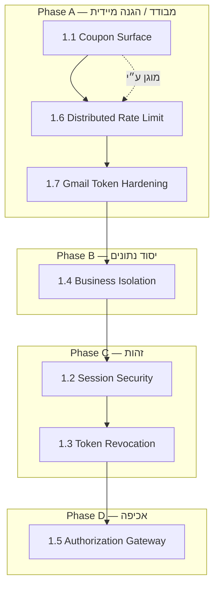

# Wave 1 — Execution Plan (Planning Only)

> **סטטוס:** v1.1 · תאריך: 2026-06-03  
> **היקף:** תכנון ביצוע בלבד — **אין** קוד, PR, migration, schema, runtime, או hardening בפועל.  
> **מקורות מחייבים:** `docs/security-policy.md`, `docs/security-architecture-review.md`, `docs/security-gap-matrix.md` (Wave 1: §3, פריטים 1.1–1.7).  
> **מטרה:** להבין מה משתנה, באיזה סדר, השפעה על המערכת, וסיכון לכל שינוי — לפני תחילת implementation.

> ---
> **⚠️ עדכון Ground Truth — 2026-07-31 (בסיס: `origin/main` @ `cd4048c`):**
> תוכנית זו היא Planning מ-2026-06-03. סטטוס ביצוע בפועל של Phase A מול הקוד:
> - **1.1 Coupon Surface (W1-01):** ✅ **Verified / Closed** — PR #157, merge `6e9935a`, 2026-07-31 (production deploy success, Closure Verification 5/5).
> - **1.6 Distributed Rate Limiting:** ✅ **Implemented** ב-mainline (Upstash).
> - **1.7 Gmail Token Encryption:** ✅ **Implemented** (GCM at-rest); ⚠️ אימות AAD=businessId פתוח.
> - **Phase B (1.4), Phase C (1.2/1.3), Phase D (1.5):** 🔴 טרם מומשו.

### החלטות ארכיטקטוניות (נעולות לתכנון)

| ID | סטטוס | השפעה על Wave 1 |
|----|--------|------------------|
| **D1** | Approved (O2 + C1–C6) — 🔴 טרם מומש | Phase C — 1.2, 1.3 |
| **D2** | **Locked** (H1–H5) — 🔴 טרם מומש | Phase B — 1.4 |
| **D3** | Approved (Upstash) — ✅ **Implemented** (mainline) | Phase A — 1.6 |

**מוכנות Phase A:** **כן** — D2 Locked אינו חוסם 1.1 / 1.6 / 1.7. H3/H5 מיושמים ב-Phase B בלבד.
**סטטוס Phase A בפועל:** 1.1 ✅ **Verified/Closed** (W1-01, PR #157), 1.6 ✅, 1.7 ✅ (AAD פתוח).

---

## 0. תקציר Wave 1

| # | פריט Gap Matrix | מדיניות (תמצית) | Effort (מטריצה) |
|---|-----------------|-----------------|-----------------|
| 1.1 | Coupon Public Surface | §2 Cross-Tenant, §4 AuthZ, Gate 2 | Small |
| 1.2 | Session Security | §3.1–3.2 Session/Token Rules | Large |
| 1.3 | Token Revocation | §3.4 Revocation | Medium |
| 1.4 | Business Isolation | §2 Multi-Tenant, Gate 1 | Large |
| 1.5 | Authorization Gateway | §4 Authorization, Gate 2 | Large |
| 1.6 | Distributed Rate Limiting | §3 + T1 brute-force | Medium |
| 1.7 | Gmail Token Encryption | §5.5, §9.3 | Medium |

**יעד Wave 1 (מאוחד):** סגירת וקטורי **T3** (B2B leak), **T6** (token compromise), **T1** (brute-force), **T2** (IDOR בשכחה), **T4** (Gmail token at rest) — לפני onboarding בקנה מידה.

---

## 1. סדר ביצוע מומלץ בתוך Wave 1

הסדר למטה **אינו** סדר המספרים ב-Gap Matrix — הוא סדר **ביצוע** עם התחשבות בתלויות, blast radius, ויכולת rollback.

| שלב | פריטים | נימוק |
|-----|--------|--------|
| **Phase A** | 1.1 → 1.6 → 1.7 | 1.1: Critical, שטח קטן, ללא תלות בזהות חדשה. 1.6: מגן על login/coupons בזמן שאר העבודות; דורש תשתית (shared store) מוקדם. 1.7: היקף מצומצם ל-Gmail; סוגר T4 לפני שינוי session רוחבי. |
| **Phase B** | 1.4 | יסוד לכל שאר ה-API; חייב לפני Gateway; מפחית סיכון IDOR בזמן מעבר Session. |
| **Phase C** | 1.2 → 1.3 | Revocation דורה מודל Session מוגדר; שינוי הכי מורגש למשתמשים — אחרי בידוד נתונים. |
| **Phase D** | 1.5 | עוטף את כל ה-routes אחרי שיש tenant layer + session; deny-by-default על בסיס מלאי מעודכן. |

**ביצוע מקביל מותר (בתכנון):** 1.1 + הכנת תשתית ל-1.6; 1.7 במקביל ל-1.6 אחרי הגדרת `GMAIL_TOKEN_ENCRYPTION_KEY` בכל סביבה.

**לא להתחיל:** 1.5 לפני 1.4; 1.3 לפני 1.2; 1.1 אחרי 1.6 (רצוי להפך — rate limit מגן על coupon endpoints).

---

## 2. תכנית מפורטת לפי פריט

---

### 1.1 — Coupon Public Surface

#### 1) מצב קיים בפועל
- `GET /api/revenue/coupons/active` — ללא auth; מחזיר עד 6 קופונים **ACTIVE** מכל העסקים (כולל `issuingBusiness.id/name`).
- `GET /api/revenue/coupons/[id]` — ללא auth; פרטי קופון ציבוריים (`coupon-details-public.service`).
- `GET /api/revenue/coupons/[id]/code` — **ללא auth**; מחזיר `token`, `qrValue`, `redeemLink` לקופון פעיל (`coupon-code.service`).
- `POST /api/coupons/[token]/redeem` — דורש Bearer + `user.businessId`.
- UI: `app/revenue/page.tsx`, `app/revenue/coupons/[id]/page.tsx`, `components/revenue/*` — קוראים ל-API ציבוריים ללא token.

#### 2) מצב יעד (Policy + Gap Matrix)
- **§2.2:** אין גישה cross-tenant למשתמש רגיל; surface ציבורי **מוגדר ומצומצם** (מטא-דאטה בלבד לפי מוצר).
- **§4.1 / Gate 2:** קוד מימוש (`token`/QR) **רק** לאחר אימות/הרשאה מפורשת (Bearer או מנגנון redeem ייעודי מתועד).
- **§9 / abuse:** rate limit + anti-enumeration על endpoints ציבוריים שנשארים.
- Gap Matrix 1.1: אין חשיפת `token` ללא auth.

#### 3) קבצים מושפעים (מיפוי)
| אזור | קבצים |
|------|--------|
| API | `app/api/revenue/coupons/active/route.ts`, `[id]/route.ts`, `[id]/code/route.ts` |
| Services | `lib/services/revenue/active-coupons.service.ts`, `coupon-code.service.ts`, `coupon-details-public.service.ts` |
| Related | `app/api/coupons/[token]/redeem/route.ts`, `lib/services/redeem.service.ts` |
| Frontend | `app/revenue/page.tsx`, `app/revenue/coupons/[id]/page.tsx`, `components/revenue/issue/*`, `components/revenue/redeem/*`, `app/promotions/coupons/page.tsx` |
| Docs/tests | כל spec שמניח QR ציבורי; בדיקות אינטגרציה ל-revenue flow |

#### 4) שכבות מושפעות
| שכבה | השפעה |
|------|--------|
| **API** | עיקרי — חוזה response, status codes, auth requirement |
| **Auth** | משני — הגדרת מי רואה `code` (issuer staff / redeemer / public meta only) |
| **DB** | מינימלי — אין חובה בשינוי schema; אולי שדות/flags ל"public redeem mode" (תכנון עתידי) |
| **Storage** | אין |
| **Integrations** | אין |
| **Frontend** | גבוה — זרימת QR/הצגת קוד, deep links, מסכי issue/redeem |

#### 5) רמת סיכון בביצוע
| רמה | **Medium** |
|-----|------------|
| סיבה | שינוי חוזה API ציבורי — שבירת deep links / QR מודפסים / אינטגרציות חיצוניות אם קיימות; דורש החלטת מוצר על UX מימוש |

#### 6) תלויות
| תלות | סוג |
|------|-----|
| **1.6 Rate Limiting** | רצוי לפני/במקביל — הגנה על `/code` ו-`/active` אחרי שינוי |
| **1.5 AuthZ Gateway** | לא חוסם — אך מסווג route כ-Public מוגדר |
| **1.2 Session** | לא חוסם ל-1.1 |

#### 7) Definition of Done

> תכנית מפורטת: `docs/security-w1-01-coupon-surface-implementation-plan.md` (D4 Approved).

- [ ] אין endpoint ציבורי שמחזיר `token` / `qrValue` ללא אימות מפורש (מתועד ב-Security Gates).
- [ ] `active` ו-`[id]` מוגדרים במדיניות: מה מותר ציבורית (מטא-דאטה) vs מה דורש auth.
- [ ] rate limit פעיל על revenue public routes (תלוי 1.6 או זמני מוגבר).
- [ ] Frontend מעודכן: אין קריאה ל-`/code` ללא session; זרימת redeem נבדקה E2E.
- [ ] Re-mapping: אימות שאין מסלול אחר ל-`coupon.token` (grep / API inventory).
- [ ] עדכון `security-gap-matrix.md` — שורת Coupon → Current State מעודכן אחרי אימות.

#### 8) Risks / Rollback
| סיכון | Mitigation (תכנון) |
|-------|---------------------|
| שבירת QR קיימים בשטח | תקופת מעבר / redirect מתועד; תקשורת ללקוחות עם קופונים פעילים |
| Regression ב-redeem | בדיקות redeem + offers flow |
| **Rollback** | feature flag על auth ל-`/code`; או שחזור route behavior + CDN cache invalidation |

---

### 1.2 — Session Security

#### 1) מצב קיים בפועל
- Token: HMAC `v1.*` (`lib/auth-token.ts`), TTL ~30 יום, **stateless**.
- Login: `app/api/auth/login/route.ts` → מחזיר `token` + `user` + `sessionId`.
- אחסון: `localStorage` (`token`, `user`) — `app/login/page.tsx`, `lib/client-session.ts`.
- ~50+ קבצי frontend קוראים `localStorage` / `buildClientAuthHeaders` ישירות או דרך helpers.
- אין `middleware.ts`; אין httpOnly cookie ל-session.
- Register לא מנפיק token — redirect ל-login.

#### 2) מצב יעד (Policy §3.1–3.2, Architecture §2.1)
- סשן **מנוהל** (שרת או access/refresh עם רישום מצב).
- **אסור** אחסון token ב-localStorage כברירת מחדל — **httpOnly, Secure, SameSite** cookies (או שקילות מתועדת).
- access קצר-מועד; הארכה דרך refresh נפרד (לא TTL 30 יום על access).
- רישום סשן/מכשיר לצורך revocation ו-visibility (§3.5 SHOULD).

#### 3) קבצים מושפעים
| אזור | קבצים (לא ממוצה) |
|------|-------------------|
| Auth core | `lib/auth-token.ts`, `lib/auth.ts`, `lib/client-session.ts` |
| API auth | `app/api/auth/login/route.ts`, `register/route.ts`, `me/route.ts` |
| Frontend | `app/login/page.tsx`, `app/register/page.tsx`, `app/(shell)/page.tsx`, כל רשימת `localStorage.getItem("token")` (~50 paths), `lib/platform-admin/fetch-platform-admin.ts`, `components/platform-admin/platform-admin-gate.tsx` |
| Inventory client | `lib/api/inventory.ts`, `app/(shell)/inventory/page.tsx` |
| Config | env: `AUTH_TOKEN_*`, cookie domain, `APP_BASE_URL` |

#### 4) שכבות מושפעות
| שכבה | השפעה |
|------|--------|
| **API** | login/logout/me; Set-Cookie; CORS/credentials policy |
| **Auth** | **קריטי** — מודל אימות חדש |
| **DB** | **תכנון עשוי לדרוש** טבלת Session/RefreshToken (לא ביצוע כאן) |
| **Storage** | אין |
| **Integrations** | callbacks OAuth נשארים cookie-based — נפרדים מ-session משתמש |
| **Frontend** | **קריטי** — הסרת Bearer מ-localStorage; `credentials: 'include'`; עדכון כל fetch |

#### 5) רמת סיכון בביצוע
| רמה | **High** |
|-----|----------|
| סיבה | שינוי חוצה-מערכת; כל משתמש מחובר מושפע; סיכון logout המוני / לoop redirect |

#### 6) תלויות
| פריט | יחס |
|------|-----|
| **1.3 Revocation** | **חוסם אחרי 1.2** — מודל session קודם |
| **1.4 Isolation** | מומלץ לפני — מפחית סיכון בזמן רגרסיות auth |
| **1.6 Rate limit** | מומלץ על login במקביל |
| **1.5 Gateway** | אחרי — gateway צריך לדעת איך לקרוא session |

#### 7) Definition of Done
- [ ] אין אחסון access token ב-`localStorage` / JS-accessible (Policy §3.2).
- [ ] כל API מאומתים מקבלים session דרך מנגנון אחיד (cookie או header מתועד).
- [ ] access TTL קצר מתועד; refresh/navigation עובדים בכל דפי `(shell)` ומחוצה להם.
- [ ] Platform admin + inventory + billing + revenue flows נבדקו.
- [ ] תקופת מעבר (אם נדרשת) מתועדת: dual-read ישן/חדש או forced re-login.
- [ ] Re-mapping: אין `getAuthToken() || "1"` fallback פעיל בפרודקשן.

#### 8) Risks / Rollback
| סיכון | הערה |
|-------|------|
| XSS הופך לפחות קריטי; CSRF עולה | **חובה** CSRF strategy בתכנון (SameSite, double-submit, או BFF) |
| Safari/ITP חוסם cookies | בדיקת domain/path |
| Mobile / embedded WebView | אימות cookie behavior |
| **Rollback** | feature flag: legacy Bearer מ-localStorage; או shorten-only TTL בלי cookies |

---

### 1.3 — Token Revocation

#### 1) מצב קיים בפועל
- `verifyAuthToken` — אימות חתימה + `exp` בלבד; אין בדיקה מול DB.
- Logout: `clearClientSession()` — client only (`lib/client-session.ts`, `SettingsSystemFooter`).
- שינוי סיסמה: **לא** מבטל tokens קיימים (אין endpoint password change ממופה).
- Legacy numeric tokens נדחים (חיובי).

#### 2) מצב יעד (Policy §3.4, §8)
- ביטול **מיידי**: logout, compromise, password change, admin action.
- רישום issued sessions/tokens (קשור ל-1.2).
- אירוע אבטחה: ביטול בקנה מידה (user / business).

#### 3) קבצים מושפעים
| אזור | קבצים |
|------|--------|
| Auth | `lib/auth-token.ts`, `lib/auth.ts` |
| API | `app/api/auth/login/route.ts`, `me/route.ts`; **חדש בתכנון:** logout, sessions list, revoke-all |
| UI | `components/settings/SettingsSystemFooter.tsx`, `app/settings/security/page.tsx` (אם קיים change password) |
| Audit | **תכנון:** רישום ב-security audit (Wave 2 — יש לתכנן נקודת חיבור) |

#### 4) שכבות מושפעות
| שכבה | השפעה |
|------|--------|
| **API** | logout, revoke, אולי middleware check session version |
| **Auth** | **קריטי** — `getCurrentUser` בודק גם session record |
| **DB** | Session table / revocation list / `sessionVersion` על User |
| **Storage** | אין |
| **Integrations** | לא מבטל WhatsApp/Gmail — נפרד (Policy §3.4) |
| **Frontend** | logout קורא API; אולי "התנתק מכל המכשירים" |

#### 5) רמת סיכון בביצוע
| רמה | **Medium–High** |
|-----|-----------------|
| סיבה | שגיאה ב-verify → lockout המוני; migration sessions קיימים |

#### 6) תלויות
| פריט | יחס |
|------|-----|
| **1.2 Session** | **חוסם קודם** |
| **1.6** | משני |
| **Wave 2 Audit** | רצוי לרישום revoke events |

#### 7) Definition of Done
- [ ] logout מבטל session בשרת — token/ cookie לא תקף מיד (Policy §3.1).
- [ ] password change (כשקיים) מבטל כל sessions של המשתמש.
- [ ] `getCurrentUser` נכשל על session מבוטל (fail closed).
- [ ] אין מסלול שבו stateless token ישן עובד אחרי revoke (אלא אם dual-mode מתועד ומוגבל בזמן).
- [ ] תרחיש compromise: תיעוד איך לבטל user/business בקנה מידה.

#### 8) Risks / Rollback
| סיכון | Rollback |
|-------|----------|
| DB migration כשל | גיבוי; rollback migration |
| ביצועים — DB hit כל request | cache session validity; JWT+jti blacklist מתועד כאלטרנטיבה |
| **Rollback** | bypass revocation check ב-flag (זמני בלבד, אסור prod ארוך) |

---

### 1.4 — Business Isolation

#### 1) מצב קיים בפועל
- Tenant: `user.businessId` מ-DB אחרי `getCurrentUser`; סינון ידני ב-~110 API routes + services.
- אין RLS ב-Postgres; אין Prisma middleware מחייב.
- `POST /api/business` — יוצר `Business` **ללא** קישור ל-`User` (orphan risk).
- Platform admin: cross-tenant מכוון (`/api/platform-admin/*`).
- WhatsApp: AAD=businessId על tokens (טוב); storage: `biz/{businessId}/...`.
- בדיקות אוטומטיות cross-tenant: **לא** קיימות כחובה ב-CI.

#### 2) מצב יעד (Policy §2, Gate 1) — **D2 Locked (H1–H5)**
- **Extension + ALS** על מודלי tenant (49→50 אחרי H1); bypass matrix מפורש.
- **H5:** FORCE RLS על 8 טבלאות Phase 1; `SET LOCAL app.business_id` בתוך transaction (**H3**); fail-closed; Platform Admin = `setTenantContext(targetBusinessId)` בלבד.
- **H3:** pooled `DATABASE_URL` (runtime); `DIRECT_URL` (migrations); staging gate לפני production.
- **H1:** `ContentFeedback` + `/api/learning` tenant-scoped — אין cross-tenant learning.
- **H2:** הסרה/השבתת `POST /api/business`; אין multi-business ב-Wave 1.
- **H4:** `TenantMode.OAUTH`; `OAuthToken` רק דרך `EmailConnection`; cookies OAuth נפרדים; H4-E → Wave 2.
- בדיקות cross-tenant §8.2 Impact Review; אין orphan business.

#### 3) קבצים מושפעים
| אזור | היקף |
|------|------|
| **DB** | `prisma/schema.prisma` — כל מודל עם `businessId`; migrations; אולי policies RLS |
| **Data access** | **חדש בתכנון:** `lib/data-access/*` או Prisma extension; כל `lib/services/**` (~258 קבצים) — הדרגתי |
| **API** | כל `app/api/**/route.ts` (125) — מעבר לשכבה מרכזית |
| **Auth** | `lib/auth.ts` — inject tenant context |
| **Storage** | `lib/storage/*`, `document-storage.service.ts`, `public-asset-storage.service.ts` |
| **Tests** | **חדש:** cross-tenant denial suite |
| **Anomaly** | `app/api/business/route.ts` — תיקון orphan |

#### 4) שכבות מושפעות
| שכבה | השפעה |
|------|--------|
| **API** | גבוה — כל route עסקי |
| **Auth** | tenant context חובה |
| **DB** | **קריטי** — RLS או equivalent |
| **Storage** | מפתחות — וידוא prefix |
| **Integrations** | webhook resolve — כבר קיים; ליישר עם שכבה |
| **Frontend** | נמוך — אין שליחת businessId (טוב) |

#### 5) רמת סיכון בביצוע
| רמה | **High** |
|-----|----------|
| סיבה | רגרסיה = דליפת נתונים (T3); RLS שגוי = 500 או deny legitimate |

#### 6) תלויות
| פריט | יחס |
|------|-----|
| **1.5 Gateway** | **אחרי 1.4** |
| **1.2 Session** | מומלץ Phase B לפני C — לא חוסם |
| **Billing compliance** | אין שינוי issued docs — רק גישה |

#### 7) Definition of Done
- [ ] אין שאילתת tenant data ללא `businessId` scope מבני (Policy §2.1).
- [ ] בדיקות אוטומטיות: user A לא רואה resource של business B (מדגם לכל domain).
- [ ] `POST /api/business` מתועד/מוסר/מוגבל — אין orphan.
- [ ] Platform admin ממשיך cross-tenant רק דרך מסלול מפורש.
- [ ] Re-mapping: אין `prisma.*.findUnique({ where: { id }})` ללא tenant ב-domains רגישים.

#### 8) Risks / Rollback
| סיכון | Rollback |
|-------|----------|
| RLS חוסם jobs ללא context | service role / bypass מתועד ל-workers בלבד |
| Prisma `$queryRaw` עוקף RLS | audit grep + איסור או session variable |
| **Rollback** | כיבוי RLS policies; חזרה ל-application-only (זמני) |

---

### 1.5 — Authorization Gateway

#### 1) מצב קיים בפועל
- אין `middleware.ts`.
- כל route קורא `getCurrentUser` / `requirePlatformAdmin` / `inventory-auth` / POS key / webhook — **ידנית**.
- אין deny-by-default; routes חדשים עלולים להישאר פתוחים.
- Roles: `USER`, `PLATFORM_ADMIN` בלבד.
- `lib/services/feature-access/require-feature-access.ts` — לא שער גלובלי.

#### 2) מצב יעד (Policy §4, Architecture §2.2)
- שכבת אכיפה **מרכזית** — כל request עובר דרכה.
- Deny-by-default; הצהרת auth + permission לכל route.
- Object-level ownership אחיד (בנוסף ל-1.4).
- מלאי routes מסווג (Public / Auth / Business / Admin / Financial / Integration).

#### 3) קבצים מושפעים
| אזור | קבצים |
|------|--------|
| **חדש בתכנון** | `middleware.ts` או equivalent; `lib/auth/route-registry.ts`; wrappers |
| API | כל `app/api/**/route.ts` (125) — הפחתת boilerplate |
| Auth | `lib/auth.ts`, `lib/auth/platform-admin.ts`, `lib/auth/inventory-auth.ts` |
| Docs | `docs/security-gap-matrix.md` — טבלת classification מעודכנת |
| Frontend | מינימלי — אם middleware גם על `/admin` pages (SSR) |

#### 4) שכבות מושפעות
| שכבה | השפעה |
|------|--------|
| **API** | **קריטי** |
| **Auth** | **קריטי** — נקודת כניסה אחת |
| **DB** | אין ישיר |
| **Storage** | אין |
| **Integrations** | מסלולים Public מוגדרים (webhook, health) |
| **Frontend** | אם נוסף server guard ל-`(platform-admin)` |

#### 5) רמת סיכון בביצוע
| רמה | **High** |
|-----|----------|
| סיבה | שגיאת config = 401 המוני או **חשיפה** אם route לא רשום |

#### 6) תלויות
| פריט | יחס |
|------|-----|
| **1.4** | **חוסם קודם** |
| **1.2** | מומלץ — gateway צריך session model |
| **1.1** | מסווג coupon routes |

#### 7) Definition of Done
- [ ] מלאי 125 routes מסווג וממופה ל-policy class.
- [ ] route לא רשום = **חסום** בפרודקשן (deny-by-default).
- [ ] Public routes מפורשים: health, auth login/register, webhooks, POS (מוגדר), revenue (לאחר 1.1).
- [ ] Platform admin + inventory + financial — הרשאות מפורשות.
- [ ] אין route עסקי ללא ownership check (שילוב 1.4).

#### 8) Risks / Rollback
| סיכון | Rollback |
|-------|----------|
| Webhook/ OAuth callback נחסמו | allowlist מדויק ל-integration paths |
| **Rollback** | כיבוי middleware; חזרה ל-per-route (מתועד) |

---

### 1.6 — Distributed Rate Limiting

#### 1) מצב קיים בפועל
- `lib/security/rate-limit.ts` — in-memory `Map`; לא shared בין instances.
- בשימוש: login (10/min IP), register (3/hr), documents upload, content upload, CSV import, POS sale.
- **לא** בשימוש: revenue coupons, רוב API, webhooks, message API.
- `docs/rate-limiting-mvp.md` — מתועד כ-MVP לא-פרודקשן multi-instance.

#### 2) מצב יעד (Policy + T1)
- Shared store (Redis/Upstash/DB-backed — **החלטת תשתית בתכנון**).
- per-IP, per-account (login), per-tenant, per-endpoint רגיש.
- Account lockout / exponential backoff ל-login (Policy §3 + Architecture Phase 1).

#### 3) קבצים מושפעים
| אזור | קבצים |
|------|--------|
| Core | `lib/security/rate-limit.ts` — refactor interface |
| **חדש** | adapter ל-shared store; config per env |
| API | `auth/login`, `auth/register`; **להוסיף:** revenue/*, `message`, webhooks (תכנון); uploads קיימים |
| Infra | env vars; deployment (Redis); observability |
| Docs | `docs/rate-limiting-mvp.md` — עדכון |

#### 4) שכבות מושפעות
| שכבה | השפעה |
|------|--------|
| **API** | עיקרי |
| **Auth** | login lockout |
| **DB** | אופציונלי אם store = DB |
| **Storage** | אין |
| **Integrations** | webhook rate limit |
| **Frontend** | הצגת 429 / retry-after |

#### 5) רמת סיכון בביצוע
| רמה | **Medium** |
|-----|------------|
| סיבה | תלות תשתית; Redis down → fail-open vs fail-closed (Policy: **fail closed** ל-auth) |

#### 6) תלויות
| פריט | יחס |
|------|-----|
| **1.1** | מגן coupon endpoints |
| **1.2** | account-based keys דורש user id |
| Infra | **חוסם** — provisioning shared store |

#### 7) Definition of Done
- [ ] rate limit עובד זהה ב-2+ instances (בדיקת עומס).
- [ ] login: IP + account; lockout מתועד.
- [ ] revenue public routes מוגבלים (אחרי 1.1).
- [ ] התנהגות כש-store לא זמין: **fail-closed** ל-auth (Policy §1.5).
- [ ] מדדים: 429 rate, top keys (תכנון observability).

#### 8) Risks / Rollback
| סיכון | Rollback |
|-------|----------|
| False positive 429 | התאמת limits; allowlist IP פנימי |
| Latency | local cache + async increment |
| **Rollback** | fallback ל-in-memory **רק** ב-dev; אסור prod multi-instance |

---

### 1.7 — Gmail Token Encryption

#### 1) מצב קיים בפועל
- `lib/services/integrations/gmail/token-crypto.placeholder.ts` — **כבר** מממש AES-256-GCM (`gcm_v1:`) + `GMAIL_TOKEN_ENCRYPTION_KEY`; fail-closed על encrypt ללא מפתח.
- **Legacy:** `enc_v0:` — base64 plaintext — **קריא** ב-`decryptToken` (backward compat).
- שימוש: `callback/route.ts`, `gmail-auth.service.ts`, `gmail-discovery.service.ts`.
- DB: `OAuthToken.accessTokenEncrypted`, `refreshTokenEncrypted` (`prisma/schema.prisma`).
- OAuth flow: PKCE + httpOnly cookies (`connect`, `callback`).
- **פער לעומת WhatsApp:** אין AAD=`businessId`; שם קובץ "placeholder"; שורות legacy ב-DB אפשריות.

#### 2) מצב יעד (Policy §5.5, §9.3)
- **אסור** `enc_v0` / plaintext בפרודקשן — רק מוצפן.
- הצפנה שקולה ל-WhatsApp (כולל **רצוי** tenant-binding / AAD).
- מפתח ב-env עם fail-fast; תוכנית re-encrypt ל-legacy rows.
- scope מינימלי; ניתוק מבטל אצל Google (קיים חלקית — לוודא).

#### 3) קבצים מושפעים
| אזור | קבצים |
|------|--------|
| Crypto | `token-crypto.placeholder.ts` (rename/align בתכנון) |
| API | `app/api/integrations/gmail/connect/route.ts`, `callback/route.ts`, `status/route.ts`, `sync/route.ts`, `import/route.ts` |
| Services | `gmail-auth.service.ts`, `gmail-discovery.service.ts`, `oauth-refresh.service.ts`, `gmail-attachment-fetch.service.ts` |
| DB | `OAuthToken`, `IntegrationConnection` — **תכנון:** migration re-encrypt |
| Env | `GMAIL_TOKEN_ENCRYPTION_KEY` — חובה ב-staging/prod |
| Compare | `lib/services/integrations/whatsapp/token-crypto.service.ts` — reference pattern |

#### 4) שכבות מושפעות
| שכבה | השפעה |
|------|--------|
| **API** | callback שומר מוצפן; import/sync קוראים |
| **Auth** | OAuth נפרד מ-user session |
| **DB** | data migration ל-legacy tokens |
| **Storage** | אין |
| **Integrations** | **קריטי** — Gmail only |
| **Frontend** | `app/(shell)/documents/email/page.tsx` — reconnect אם decrypt נכשל |

#### 5) רמת סיכון בביצוע
| רמה | **Medium** |
|-----|------------|
| סיבה | re-encrypt כושל = Gmail מנותק לעסקים; מפתח שגוי ב-deploy |

#### 6) תלויות
| פריט | יחס |
|------|-----|
| **Secrets / env** | `GMAIL_TOKEN_ENCRYPTION_KEY` בכל סביבה לפני deploy |
| **1.4** | מומלץ — AAD businessId דורש tenant context ב-crypto |
| **1.2** | לא חוסם |

#### 7) Definition of Done
- [ ] אין רשומת `OAuthToken` עם `enc_v0:` בפרודקשן (או 0% אחרי migration מוגדרת).
- [ ] encrypt תמיד `gcm_v1` + fail-closed ללא מפתח.
- [ ] decrypt נכשל בבטחה — לא מחזיר plaintext; משתמש מנותק מ-Gmail עם הודעה ברורה.
- [ ] השוואה ל-WhatsApp pattern מתועדת (AAD אם מאומץ).
- [ ] אין token בלוגים (Policy §5).

#### 8) Risks / Rollback
| סיכון | Rollback |
|-------|----------|
| Mass disconnect Gmail | תקשורת ללקוחות; reconnect flow |
| מפתח שונה בין סביבות | backup key version |
| **Rollback** | שמירת מפתח ישן ל-decrypt בלבד; לא לכתוב enc_v0 חדש |

---

## 3. מטריצת השפעה חוצה-שכבות (Wave 1)

| שכבה | 1.1 | 1.2 | 1.3 | 1.4 | 1.5 | 1.6 | 1.7 |
|------|-----|-----|-----|-----|-----|-----|-----|
| API | ●● | ●●● | ● | ●●● | ●●● | ●● | ● |
| Auth | ● | ●●● | ●●● | ●● | ●●● | ●● | ● |
| DB | ○ | ●● | ●● | ●●● | ○ | ● | ●● |
| Storage | ○ | ○ | ○ | ● | ○ | ○ | ○ |
| Integrations | ○ | ○ | ○ | ● | ● | ● | ●●● |
| Frontend | ●● | ●●● | ● | ○ | ● | ○ | ● |

●●● = השפעה גבוהה · ●● = בינונית · ● = נמוכה · ○ = זניחה

---

## 4. Security Hardening Backlog — Wave 1 (ממוין לביצוע)

| Seq | ID | פריט | Phase | Severity | Effort | תלות | סיכון ביצוע |
|-----|-----|------|-------|----------|--------|------|-------------|
| 1 | W1-01 | Coupon Public Surface | A | Critical | S | — | Medium |
| 2 | W1-02 | Distributed Rate Limiting (infra + auth + coupons) | A | High | M | Infra | Medium |
| 3 | W1-03 | Gmail Token Hardening (legacy + policy alignment) | A | High | M | Env key | Medium |
| 4 | W1-04 | Business Isolation (structural) | B | Critical | L | — | High |
| 5 | W1-05 | Session Security (cookie model) | C | Critical | L | W1-04 מומלץ | High |
| 6 | W1-06 | Token Revocation | C | Critical | M | W1-05 | Med–High |
| 7 | W1-07 | Authorization Gateway + route inventory | D | High | L | W1-04, W1-05 | High |

### קריטריון סגירת Wave 1 (כולה)
- [ ] כל DoD של W1-01 עד W1-07 מאומת ב-**Security Re-Mapping** (לא רק "מוזרק קוד").
- [ ] `docs/security-gap-matrix.md` — עמודת Current State מעודכנת ל-7 התחומים.
- [ ] אין חריגה מ-Policy §חובה/אסור ללא sign-off (§13 Governance).
- [ ] Threat T3, T6, T1, T2, T4 — סטטוס "מטופל" מתועד ב-threat model או סקירה חוזרת.

---

## 5. החלטות תכנון — סטטוס

| # | החלטה | סטטוס | משפיע על |
|---|--------|--------|----------|
| D1 | O2 — Server Session + Postgres + httpOnly (C1–C6) | **Approved** | 1.2, 1.3 |
| D2 | Hybrid — Extension + ALS + RLS Phase 1 (H1–H5) | **Locked** | 1.4 |
| D3 | Upstash Redis + fail-closed | **Approved** | 1.6 |
| D4 | QR/קוד מימוש לא ציבורי; מטא-דאטה שיווקי מותר; redeem מורשה בלבד | **Approved** | 1.1 — `docs/security-w1-01-coupon-surface-implementation-plan.md` |
| D5 | Gmail AAD=businessId | **Pending** | 1.7 |
| D6 | Dual-mode auth (Bearer + cookie) | **Pending** (תלוי D1 rollout) | 1.2, 1.3 |

**Phase A:** D4 + D5 **Approved** — W1-01 מתועד ב-`docs/security-w1-01-coupon-surface-implementation-plan.md`; אישור §16 שם לפני PR.

---

## 6. מה מחוץ ל-Wave 1 (לא לשלב בביצוע זה)

- Platform Admin MFA + server guard (Wave 2 — 2.1)
- Security audit trail אחיד (Wave 2 — 2.2)
- WhatsApp per-tenant media token (Wave 2 — 2.4)
- MFA למשתמשים (Wave 3 — 3.4)
- Vault/KMS (Wave 3 — 3.1)

---

## 7. קישור ל-Governance

לפני כל PR של Wave 1: עבור **Security Gates** (`docs/security-policy.md` §12) לכל feature נוגע; עדכן Gap Matrix אחרי Re-Mapping.

---

*סוף מסמך — Wave 1 Execution Planning בלבד.*
